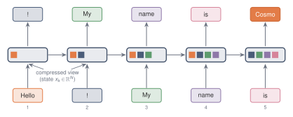
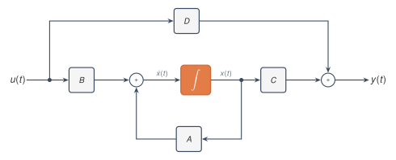

A state space model replaces a growing history with a fixed vector. The mathematical problem is to make that replacement precise. Four roles have to be separated before any solution or discretisation is introduced: the state that carries memory, the input map that writes into it, the internal dynamics that move it forward, and the output map that reads from it.

## 2.1 What problem is the model trying to solve? {#sec-2-1}

A sequence model receives information over time. At each moment, or at each position in a sequence, a new input arrives. The model needs a rule that determines how each new input affects future outputs.

One extreme solution is to store the entire past. That is usually impossible or undesirable. The past can be arbitrarily long, while the model must use a fixed amount of memory. A state space model takes the opposite approach. It keeps a fixed-size vector called the state. The state is updated as new input arrives, and all information from the past must pass through this state.

The basic question is

$$\text{How can a fixed-dimensional vector summarise a growing input history?}$$

A state space model specifies the rule by which this state evolves over time.

Two objects must be kept separate. A state space model is the mathematical rule that maps an input signal to an output signal by evolving an internal state. It is defined by matrices and by an equation of motion. A neural network architecture is the larger block that wraps this rule with learned projections, nonlinearities, normalisation, gates, and other components. The state space rule is the mathematical object. Surrounding architectural components matter only when they change the state space computation.

In continuous time, the input is a function of a real variable $t$, and the state evolves according to a differential equation. Sampled sequences use a discrete recurrence obtained from that continuous model.

{fig-alt="A long input history funnelling into a single fixed-size state, then a few outputs." fig-align="center" width="80%"}

## 2.2 The state equation {#sec-2-2}

Let the input be a scalar function

$$
u:\R_{\ge 0}\to\R.
$$

At time $t$, the model stores a state

$$
x(t)\in\R^N.
$$

The integer $N$ is the **state dimension**. It is the number of real values the model is allowed to use to represent the past.

The state should evolve locally in time: the derivative $x'(t)$ should depend on the current state $x(t)$ and the current input $u(t)$, not directly on older values such as $u(t-1)$ or $u(t-2)$. Older inputs can still matter, but only through their effect on the current state.

The simplest such rule is a linear one:

$$
\boxed{
x'(t)=Ax(t)+Bu(t).
}
$$

The output is read from the state by another linear map:

$$
\boxed{
y(t)=Cx(t).
}
$$

The matrices have shapes

$$
A\in\R^{N\times N},
\qquad
B\in\R^{N\times 1},
\qquad
C\in\R^{1\times N}.
$$

The matrix $A$ controls how the state evolves when no input is present. The matrix $B$ controls how the input enters the state. The matrix $C$ controls how the state is converted into an output. These roles are kept separate because memory can fail at any of the three interfaces: the input may not write useful directions, the dynamics may destroy them, or the output may not read them.

Classical state space notation often includes a direct input-to-output term,

$$
y(t)=Cx(t)+\feed u(t).
$$

That term is called a **direct feedthrough** term because the current input reaches the output without first passing through the state. It is omitted. In the state space models considered in the main line, all memory and all delayed effects pass through $x(t)$, and the output equation is

$$
y(t)=Cx(t).
$$

The symbol $D$ is therefore not used for model dimension. The model dimension of a vector representation will be written as

$$
\dmodel.
$$

::: {.callout-note title="Conventions"}
Unless stated otherwise, the system is deterministic, linear, time-invariant, causal, and initialised with $x(0)=0$. The input and output are scalar unless a multi-input multi-output form is explicitly written. There is no direct feedthrough term. After discretisation, the output is read after the current input has entered the state, so $y_k=Cx_{k+1}$ and the first discrete kernel coefficient is $\bar K_0=C\bar B$.
:::

The equations define a **single-input single-output** system, often abbreviated **SISO**. There is one input coordinate, one output coordinate, and an $N$-dimensional state:

$$
u(t)\in\R,
\qquad
x(t)\in\R^N,
\qquad
y(t)\in\R.
$$

The more general form is **multi-input multi-output**, or **MIMO**. In that case,

$$
u(t)\in\R^p,
\qquad
x(t)\in\R^N,
\qquad
y(t)\in\R^q,
$$

and the equations are

$$
x'(t)=Ax(t)+Bu(t),
\qquad
y(t)=Cx(t),
$$

with

$$
A\in\R^{N\times N},
\qquad
B\in\R^{N\times p},
\qquad
C\in\R^{q\times N}.
$$

The SISO case is obtained by taking $p=q=1$. Most formulas are written in SISO form because the notation is lighter. The meaning is the same in the MIMO case, except that the impulse response and the discrete kernel become matrices rather than scalars.

A third form appears often in neural sequence models. If the representation at each position has model dimension $\dmodel$, one may run one SISO state space model on each coordinate and perform mixing across coordinates outside the state space model. A **coordinate-wise SISO** model differs from a MIMO state space model. In a coordinate-wise SISO model, each coordinate has its own scalar input and scalar output. In a MIMO model, several input coordinates enter one shared state and several output coordinates are read from it.

{fig-alt="Block diagram of u to B to state x with self-loop A to C to y." fig-align="center" width="80%"}

## 2.3 What does it mean for the state to be memory? {#sec-2-3}

The state is not a list of previous inputs. It is a compressed summary. Memory is therefore a property of the input-output map through $x(t)$, not a claim that the state contains a copy of every past input.

If two different input histories produce the same state at time $t$, then the state space model cannot distinguish them after time $t$. Under the same future input, they will produce the same future state and the same future output.

The state $x(t)$ is the model's memory in a precise sense. The past affects the future only through the state it has produced.

The locality assumption rules out explicit delay terms unless they are folded into the state. A rule such as

$$
x'(t)=Ax(t)+A_\delta x(t-\delta)+Bu(t)
$$

does not have the same form, because it explicitly depends on an older state $x(t-\delta)$. One could enlarge the state to include whatever older quantities are needed, but then that enlarged vector would become the state. In the finite-dimensional state space model, all memory is carried by the vector $x(t)\in\R^N$.

Even within this finite vector, not every direction is equally useful. The state space $\R^N$ may be large, but the input and output reach only part of it.

The input enters through $B$. After one instant, that input has been moved around by $A$. After more time, it has been moved around by higher powers and exponentials of $A$. Thus the directions that can be created by the input are determined by $B$ together with the dynamics $A$.

The output is read through $C$. A direction in the state is useful to the output only if it can eventually be seen by $C$ after the state evolves.

In control theory, these ideas are formalised by **controllability** and **observability**.[^control-controllability-observability] Controllability asks which state directions can be reached from the input. Observability asks which state directions can be detected from the output. Their full theory is not needed for the present calculation. The intuition is enough. The state dimension $N$ is useful only insofar as the input can write into the state and the output can read from it.

Reachability and readability say which directions can matter. The next obstruction is persistence: even a reachable and readable direction can disappear too quickly. Memory fades. Take a scalar state $x_{k+1}=a x_k+b u_k$ with $0<a<1$, start from rest, and hold the input fixed at $u_k=1$. Each step adds $b$ and shrinks the accumulated total by the factor $a$, so the state climbs towards a fixed value and then stops moving. Setting $x_{k+1}=x_k=x_\infty$ in the recurrence gives $x_\infty=ax_\infty+b$, hence the **steady state** $x_\infty=b/(1-a)$. Numerically iterating the recurrence for two values of $a$ confirms convergence to this limit.

```{python}
import numpy as np
from ssm_book.numpy_ref.state_memory import scalar_memory

u = np.ones(200)          # a constant input, held from rest
b = 1.0
for a in (0.5, 0.9):
    y = scalar_memory(u, a=a, b=b)
    final = float(y[-1].real)
    steady = b / (1.0 - a)        # the fixed point b / (1 - a)
    gap = abs(final - steady)
    print(f"a = {a}:  final = {final:7.4f}   "
          f"steady = {steady:7.4f}   gap = {gap:.1e}")
```

A smaller $a$ forgets faster and reaches its smaller steady state sooner. A larger $a$ holds onto each input longer and settles towards a larger value. The printed gap is the remaining transient $a^{200}b/(1-a)$ from the zero initial state, up to rounding. For $a=0.5$ this transient is beyond double-precision resolution. For $a=0.9$ it is small but still finite, about $7\times10^{-9}$.

## 2.4 Notation {#sec-2-4}

| Symbol | Meaning | Type |
|---|---|---|
| $t$ | continuous time | $\R_{\ge 0}$ |
| $u(t)$ | scalar input in the SISO case | $\R$ |
| $x(t)$ | state | $\R^N$ |
| $y(t)$ | scalar output in the SISO case | $\R$ |
| $N$ | state dimension | positive integer |
| $\dmodel$ | model dimension of a vector representation | positive integer |
| $p$ | number of input coordinates in a MIMO system | positive integer |
| $q$ | number of output coordinates in a MIMO system | positive integer |
| $A$ | state matrix | $\R^{N\times N}$ |
| $B$ | input matrix | $\R^{N\times 1}$ or $\R^{N\times p}$ |
| $C$ | output matrix | $\R^{1\times N}$ or $\R^{q\times N}$ |
| $\feed$ | omitted direct feedthrough matrix | context-dependent |


[^control-controllability-observability]: The state equation and the reading of the state as memory are standard in linear systems theory. Controllability describes the state directions reachable from the input, and observability describes the state directions detectable from the output; see Kailath [@kailath1980].


## Summary {.unnumbered}

A state space model stores a finite-dimensional state $x(t)$ and updates it with the current input. In the linear continuous-time case,

$$
x'(t)=Ax(t)+Bu(t),
\qquad
y(t)=Cx(t),
$$

where $A$ gives the internal dynamics, $B$ injects the input, and $C$ reads the output. The state is the only route by which past inputs can affect future outputs.

For the linear models considered in this text, an $N$-dimensional state cannot encode every possible length-$L$ history when $L>N$. The state is therefore a designed compression of the past, not a stored transcript of it.

## Exercises {.unnumbered}

1. In the linear state space models considered in this text, the state $x(t)$ has $N$ real coordinates, while an input history of length $L$ has $L$ real values. Argue that when $L>N$ a linear state map cannot store an arbitrary input history exactly, and explain why this forces the state to be a compressed summary rather than a record. State what property of the map from histories to states makes the loss of information unavoidable.

   *Hint: compare the dimension of the space of possible histories with the dimension of the state. A linear map into an $N$-dimensional state cannot assign a different state vector to every possible long history when $L>N$.*

   ::: {.callout-tip collapse="true"}
   ## Solution

   From a zero initial state, the state reached after a length-$L$ history is a linear function of that history: $x=Mu$ for a fixed $N\times L$ matrix $M$ whose columns hold the contributions of $u_0,\dots,u_{L-1}$. When $L>N$ the rank of $M$ is at most $N<L$, so its null space is non-trivial. Two histories differing by a null-space vector map to the same state, and no later computation can separate them. The state keeps only the $N$-dimensional image $Mu$, a compressed summary rather than a record. The loss follows from the rank of $M$: a linear map into $\R^N$ cannot be injective on $\R^L$ when $L>N$.
   :::

2. Consider the scalar recurrence $x_{k+1}=ax_k+bu_k$ with $0<a<1$, $b=1$, started from $x_0=0$. For an arbitrary fixed value of $a$ in this interval, exhibit two distinct input sequences $(u_0,u_1)$ and $(u_0',u_1')$ of length two that produce the same state $x_2$. Explain, using the discussion of the state as memory, why the model cannot distinguish these two histories at any later time under the same future input.

   ::: {.callout-tip collapse="true"}
   ## Solution

   From $x_0=0$, $x_1=u_0$ and $x_2=ax_1+u_1=au_0+u_1$, so $x_2$ depends on the history only through the single scalar $au_0+u_1$. For the given value of $a$, the two histories $(1,0)$ and $(0,a)$ are distinct and both give $x_2=a$. The recurrence fixes every later state from the current state and the future inputs. Two histories that reach the same $x_2$ are therefore indistinguishable from then on under identical future input, because the state is the only route through which the past acts on the future.
   :::

3. For the scalar recurrence $x_{k+1}=ax_k+bu_k$ with a constant input $u_k=c$, derive the steady state. Set $x_{k+1}=x_k=x_\infty$, solve for $x_\infty$, and show that $x_\infty=bc/(1-a)$ when $|a|<1$. Explain why the condition $|a|<1$ is needed for convergence from a generic initial state, and describe what happens to the iterates when $a=1$ and when $a>1$ if the constant drive $bc$ is non-zero.

   ::: {.callout-tip collapse="true"}
   ## Solution

   A fixed point satisfies $x_\infty=ax_\infty+bc$, so $x_\infty(1-a)=bc$ and $x_\infty=bc/(1-a)$ when $a\ne1$. Unrolling from $x_0=0$ gives $x_k=bc\sum_{j=0}^{k-1}a^j$, a geometric series with limit $bc/(1-a)$ when $|a|<1$. More generally, the deviation from the fixed point is multiplied by $a$ at every step, so convergence from a generic initial state requires $|a|<1$. At $a=1$ and $bc\ne0$, the sum is $bck$, which grows without bound, and the update $x_{k+1}=x_k+bc$ never settles. For $a>1$ and $bc\ne0$, the terms $a^j$ grow and the iterates diverge geometrically. The condition $|a|<1$ is the same one that makes the mode decay rather than persist or grow.
   :::

4. Modify the demonstration in @sec-2-3 to sweep $a$ over several values in $(0,1)$ with $b$ fixed and the constant input $u_k=1$. For each $a$, run the recurrence with `scalar_memory`, record the final output and the predicted steady state $b/(1-a)$, and report the largest gap between them. Then halve the number of steps and describe how the gap changes for the larger values of $a$.

   ::: {.callout-tip collapse="true"}
   ## Solution

   The gap is the distance between the final output and $b/(1-a)$, and it is largest for $a$ closest to $1$ because the transient decays like $a^k$.

   ```python
   import numpy as np
   from ssm_book.numpy_ref.state_memory import scalar_memory

   for steps in (200, 100):
       gaps = []
       for a in (0.3, 0.6, 0.9):
           y = scalar_memory(np.ones(steps), a=a, b=1.0)
           gaps.append(abs(float(y[-1].real) - 1.0 / (1.0 - a)))
       print(steps, max(gaps))
   ```

   At $200$ steps the largest gap comes from $a=0.9$ and is about $10\cdot0.9^{200}\approx7\times10^{-9}$; the gaps for $a=0.3$ and $a=0.6$ are at roundoff. At $100$ steps the $a=0.9$ residual is about $10\cdot0.9^{100}\approx3\times10^{-4}$, while the smaller rates remain near roundoff. Halving the horizon therefore affects only the slowly decaying modes.
   :::
