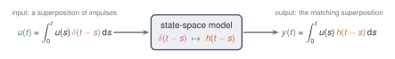
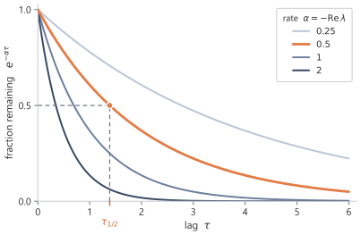

The state equation is local in time, but memory is not. The derivative only describes the next instant; the state at time $t$ contains the accumulated effect of all earlier inputs. Solving the differential equation turns the local update into an integral over the past, with the matrix exponential giving the weight assigned to each lag.[^continuous-systems-reference]

## 3.1 Solving the differential equation {#sec-3-1}

The equation

$$
x'(t)=Ax(t)+Bu(t)
$$

defines the model locally. It tells us how the state changes at an instant.

Memory is a global question. An input value from an earlier time $s$ affects the state at a later time $t$ through the full solution of the differential equation.

The current state is a weighted accumulation of past inputs, and the matrix $A$ determines the weights.

The one-dimensional case removes matrix notation while keeping the basic mechanism.

When $N=1$, the state space is $\R$. The matrices $A$, $B$, and $C$ each have one entry. Write

$$
A=[a],
\qquad
B=[b],
\qquad
C=[c],
$$

with $a,b,c\in\R$. Identifying each $1\times 1$ matrix with its single entry, the state equation becomes

$$
x'(t)=ax(t)+bu(t).
$$

First ignore the input. If $u(t)=0$, then

$$
x'(t)=ax(t),
$$

whose solution is

$$
x(t)=e^{at}x(0).
$$

Thus $a$ controls the natural behaviour of the state. If $a<0$, the state decays. If $a>0$, the state grows. If $a=0$, the state remains constant when no input is present.

Include the input. Rewrite

$$
x'(t)-ax(t)=bu(t).
$$

Multiplying both sides by $e^{-at}$ gives

$$
\frac{\dd}{\dd t}\left(e^{-at}x(t)\right)
=
e^{-at}bu(t).
$$

Integrating from $0$ to $t$,

$$
e^{-at}x(t)-x(0)
=
\int_0^t e^{-as}bu(s)\dd s.
$$

Multiplying by $e^{at}$ gives

$$
x(t)
=
e^{at}x(0)
+
\int_0^t e^{a(t-s)}bu(s)\dd s.
$$

The solution gives a precise picture of memory. The input value $u(s)$ contributes to $x(t)$ with weight

$$
e^{a(t-s)}b.
$$

The quantity $t-s$ is the elapsed time between the input time $s$ and the present time $t$. If $a<0$, then inputs farther in the past receive smaller weight. The scalar state is therefore an exponentially weighted summary of the past input.

For higher-dimensional states, the same idea holds, but scalar exponentials are replaced by matrix exponentials.

For a square matrix $M$, the **matrix exponential** is defined by

$$
e^M
=
\sum_{k=0}^{\infty}\frac{M^k}{k!}
=
I+M+\frac{M^2}{2!}+\frac{M^3}{3!}+\cdots.
$$

The reason this object appears is that it solves the matrix version of exponential growth and decay. The function $t\mapsto e^{At}$ satisfies

$$
\frac{\dd}{\dd t}e^{At}=Ae^{At},
\qquad
e^{A\cdot 0}=I.
$$

Using the same integrating-factor argument as in the one-dimensional case, the solution of

$$
x'(t)=Ax(t)+Bu(t)
$$

is

$$
\boxed{
x(t)
=
e^{At}x(0)
+
\int_0^t e^{A(t-s)}Bu(s)\dd s.
}
$$

With the empty initial state $x(0)=0$,

$$
x(t)
=
\int_0^t e^{A(t-s)}Bu(s)\dd s.
$$

This is the zero-state response, the part of the solution produced by the input alone.

The output is

$$
y(t)
=
Cx(t)
=
\int_0^t Ce^{A(t-s)}Bu(s)\dd s.
$$

The state equation and the convolution describe the same input-output map. The differential equation carries memory through $x(t)$; the integral removes the state and shows the weight assigned to every past time.

The convolution formula specifies how the past is compressed into the state and read out. The input at time $s$ first enters through $B$, then evolves for elapsed time $t-s$ through $e^{A(t-s)}$, and is finally read out through $C$.

In the MIMO case, the same expression holds with $u(s)\in\R^p$ and $y(t)\in\R^q$. The product

$$
Ce^{A(t-s)}B
$$

is then a $q\times p$ matrix. Its $(r,i)$ entry describes how the $i$th input coordinate affects the $r$th output coordinate after lag $t-s$.

## 3.2 Lag and the impulse response {#sec-3-2}

The output formula is

$$
y(t)
=
\int_0^t Ce^{A(t-s)}Bu(s)\dd s.
$$

Here $s$ is the time at which an input value was received, and $t$ is the time at which the output is evaluated. Since $0\le s\le t$, the quantity

$$
t-s
$$

is the elapsed time between the input event and the output time. The elapsed time is called the lag. A recent input has small lag. A distant input has large lag.

The factor multiplying $u(s)$ is

$$
Ce^{A(t-s)}B.
$$

It depends on the input time $s$ only through the lag $t-s$. The system's response to a past input can therefore be described by a single function of the lag.

Define

$$
h(\tau)=Ce^{A\tau}B,
\qquad
\tau\ge 0,
$$

and set

$$
h(\tau)=0
\qquad
\text{for }\tau<0.
$$

Then the output becomes

$$
y(t)
=
\int_0^t h(t-s)u(s)\dd s.
$$

The output has convolution form:

$$
y=h*u.
$$

The function $h$ is called the impulse response. It is the output pattern produced by an idealised unit input at one instant, and it gives the lag-dependent weight that connects each input value to later outputs.

For a MIMO system, $h(\tau)$ is matrix-valued:

$$
h(\tau)\in\R^{q\times p}.
$$

Each lag has an input-output matrix rather than a single scalar weight.

On a grid of lags, $h(\tau)=Ce^{A\tau}B$ separates a scalar decay from a decayed rotation. The scalar system $A=[-1]$ gives a single exponential. The $2\times2$ rotating system changes sign as it decays.

```{python}
import numpy as np
from ssm_book.numpy_ref.continuous import impulse_response

ts = np.array([0.0, 0.5, 1.0, 2.0, 4.0])

# (i) scalar decay: A=[-1]
h_decay = impulse_response([[-1.0]], [1.0], [1.0], ts).real.reshape(-1)

# (ii) decayed rotation: eigenvalues -gamma +/- i*omega
gamma, omega = 0.3, 2.0
A = [[-gamma, omega], [-omega, -gamma]]
h_rot = impulse_response(A, [1.0, 0.0], [1.0, 0.0], ts).real.reshape(-1)

np.round(np.stack([ts, h_decay, h_rot]), 4)
```

As the lag $\tau$ increases, the scalar response decreases monotonically because a single negative eigenvalue gives a fading weight. The rotating response decays in magnitude but changes sign, reflecting the oscillation produced by the imaginary parts $\pm\omega$.

![Figure 3.1. The impulse response $h(\tau)=Ce^{A\tau}B$ against the lag $\tau$. The scalar system $A=[-1]$ gives a single fading exponential $e^{-\tau}$ (blue). The decayed rotation, with eigenvalues $-0.3\pm 2i$, gives $e^{-0.3\tau}\cos 2\tau$ (orange), fading in magnitude but changing sign within the envelope $\pm e^{-0.3\tau}$ (dashed). The dots mark the lags $\tau=0,0.5,1,2,4$. Both systems start at $h(0)=CB=1$.](../../figures/fig-3-1-lag.svg){fig-alt="Two impulse-response curves against lag tau: a blue monotone exponential, and an orange decaying oscillation bounded by a dashed envelope, with dots at tau = 0, 0.5, 1, 2, 4, and both curves starting at 1." fig-align="center" width="75%"}

The convolution also has a simple construction. Write $\delta$ for the unit impulse, the idealised spike concentrated at time zero with $\int \delta(r-s)f(r)\,\dd r=f(s)$. Every input is itself a superposition of shifted impulses,

$$
u(r)=\int_0^\infty u(s)\,\delta(r-s)\,\dd s,
$$

one spike at each instant $s$ weighted by $u(s)$. At output time $t$, causality restricts the contributing impulses to $0\le s\le t$. The system turns each shifted impulse $\delta(\cdot-s)$ into the shifted impulse response $h(t-s)$, and because the same matrices $A$, $B$, $C$ apply at every time, the response to the whole input is the matching superposition,

$$
y(t)=\int_0^t h(t-s)\,u(s)\,\dd s,
$$

the same convolution as before. Each input impulse contributes one scaled, shifted copy of $h$, and the copies add up.

{fig-alt="Block diagram: input as an integral of shifted impulses, a linear time-invariant system box mapping delta to h, output as an integral of shifted impulse responses." fig-align="center" width="92%"}

## 3.3 How the eigenvalues of $A$ shape memory {#sec-3-3}

The impulse response is

$$
h(\tau)=Ce^{A\tau}B.
$$

Thus the behaviour of $h$ is controlled by $e^{A\tau}$. The memory mechanisms are the functions that can appear inside this matrix exponential.

The clearest case is when $A$ can be diagonalised. Suppose $A$ has $N$ linearly independent eigenvectors

$$
v_1,\dots,v_N
$$

with corresponding eigenvalues

$$
\lambda_1,\dots,\lambda_N.
$$

Place the eigenvectors into the columns of a matrix

$$
V=
\begin{pmatrix}
| & | & & |\\
v_1 & v_2 & \cdots & v_N\\
| & | & & |
\end{pmatrix},
$$

and define

$$
\Lambda=\diag(\lambda_1,\dots,\lambda_N).
$$

Then

$$
A=V\Lambda V^{-1}.
$$

In the eigenvector coordinate system, the action of $A$ separates into independent scalar modes. The matrix exponential becomes

$$
e^{A\tau}
=
Ve^{\Lambda\tau}V^{-1},
$$

where

$$
e^{\Lambda\tau}
=
\diag
\left(
e^{\lambda_1\tau},
\dots,
e^{\lambda_N\tau}
\right).
$$

So the impulse response is built from scalar exponential modes

$$
e^{\lambda_i\tau}.
$$

If

$$
\lambda_i=-\alpha_i+i\omega_i,
$$

then

$$
e^{\lambda_i\tau}
=
e^{-\alpha_i\tau}
\left(
\cos(\omega_i\tau)
+
i\sin(\omega_i\tau)
\right).
$$

The decay rate $\alpha_i$ controls growth or decay. The real part of the eigenvalue is $-\alpha_i$, so a stable mode has $\alpha_i>0$. The imaginary part $\omega_i$ controls oscillation.

Thus:

- eigenvalues with negative real part give decaying modes;
- eigenvalues close to the imaginary axis decay slowly and can preserve information for longer;
- eigenvalues with nonzero imaginary part give oscillatory modes;
- eigenvalues with positive real part grow and are usually unstable.

When $\Real\lambda_i<0$, a useful way to measure the timescale of the mode is its half-life. The **continuous half-life** is the lag $\tau_{1/2}$ for which the magnitude has decayed by a factor of two:

$$
e^{(\Real\lambda_i)\tau_{1/2}}=\frac12.
$$

Therefore

$$
\boxed{
\tau_{1/2}=\frac{\log 2}{-\Real\lambda_i}=\frac{\log 2}{\alpha_i}.
}
$$

The half-life translates an eigenvalue into a memory length in continuous time.

The state matrix supplies the available memory modes through these eigenvalues.

The eigenvalues just used were complex, although the state matrix itself was real. Complex eigenvalues appear naturally when a real matrix contains rotations.

If $A$ is real and $\lambda=-\alpha+i\omega$ is an eigenvalue, then its complex conjugate $\bar\lambda=-\alpha-i\omega$ is also an eigenvalue. The corresponding complex modes combine to produce real sine and cosine terms. Thus complex eigenvalues do not force the state or output to become complex. They are often a compact way of describing a real two-dimensional rotation.

The simplest real rotation already appears in two dimensions. The matrix

$$
\begin{pmatrix}
0 & \omega\\
-\omega & 0
\end{pmatrix}
$$

has eigenvalues $\pm i\omega$, but its action on $\R^2$ is planar rotation. Adding a negative multiple of the identity makes that rotation decay.

The diagonalisable case explains the main intuition, but not every matrix has a full set of eigenvectors. The same memory picture still holds, with one additional feature.

A Jordan block with eigenvalue $\lambda$ has the form

$$
J=\lambda I+R,
$$

where $R$ is nilpotent, meaning that some power of $R$ is zero. Since $\lambda I$ and $R$ commute,

$$
e^{J\tau}=e^{\lambda\tau}e^{R\tau}.
$$

If the block has size $r$, then $R^r=0$, so

$$
e^{R\tau}
=
I+\tau R+\frac{\tau^2}{2!}R^2+\cdots+\frac{\tau^{r-1}}{(r-1)!}R^{r-1}.
$$

Thus a non-diagonalisable block contributes exponential terms multiplied by polynomials in the lag:

$$
\tau^m e^{\lambda\tau}.
$$

The real part of $\lambda$ still controls exponential growth or decay. The Jordan structure adds polynomial factors on top of that exponential behaviour. For $\Real\lambda=-\alpha<0$ the weight $\tau^m e^{-\alpha\tau}$ first grows like $\tau^m$ and only then decays, peaking near $\tau=m/\alpha$, so a non-diagonalisable mode weights inputs at an intermediate lag most heavily rather than the most recent ones.

{fig-alt="Several exponential decay curves with a half-life construction on one." fig-align="center" width="80%"}

![Figure 3.4. An eigenvalue $\lambda=-\alpha+i\omega$ of $A$ in the complex plane, with decay rate $\alpha>0$ so that $\Real\lambda=-\alpha$ lies in the shaded stable region $\Real\lambda<0$. The decay rate $\alpha$ sets the fading and the imaginary part $\omega$ the oscillation frequency. The distance from the origin $|\lambda|$ measures the mode's overall rate, and the angle $\theta$ from the negative real axis its balance of decay to oscillation. For a real matrix the eigenvalues occur in conjugate pairs $\lambda,\bar\lambda$, mirrored across the real axis.](../../figures/fig-3-4-eigenvalues.svg){fig-alt="Complex plane with the stable left half-plane shaded, a conjugate pair on a circle of radius the eigenvalue magnitude, and the angle from the negative real axis." fig-align="center" width="70%"}

## 3.4 Fading memory and oscillatory memory {#sec-3-4}

The memory of the model is built from modes of $A$. The two simplest mechanisms are **fading memory** and **oscillatory memory**.

A real negative eigenvalue gives a decaying exponential, which behaves like a fading average of the past. A complex conjugate pair gives rotation, which can represent oscillatory or phase-like information.

Two examples isolate these mechanisms.

### A fading one-dimensional memory {#sec-3-4-1}

Take $N=1$ and write

$$
A=[a],
\qquad
B=[b],
\qquad
C=[c],
$$

with

$$
a<0.
$$

The impulse response is

$$
h(\tau)=ce^{a\tau}b,
\qquad
\tau\ge 0.
$$

The output is

$$
y(t)
=
cb\int_0^t e^{a(t-s)}u(s)\dd s.
$$

The output is an exponentially weighted running total of the past input. The rate $-a$ determines how quickly older information is discounted. The half-life from @sec-3-3 turns this rate into a number. For $a=-1$ the half-life is $\log 2\approx 0.69$, so a lag of $0.69$ halves the weight, and at lag $2$ the weight is $e^{-2}\approx 0.135$, the value the dots in Figure 3.1 mark on the blue curve.

This is the continuous-time exponential moving average, with $-a$ playing the part of the forgetting rate. A small $-a$ keeps a long memory and a large $-a$ forgets almost at once.

For example, if

$$
u(s)=1
$$

for all $s$, then

$$
x(t)
=
b\int_0^t e^{a(t-s)}\dd s
=
\frac{b}{a}\left(e^{at}-1\right).
$$

Since $a<0$,

$$
x(t)\to -\frac{b}{a}
\qquad
\text{as }t\to\infty.
$$

The state approaches a finite value because old input is continuously discounted. The limit has a direct reading. Writing $-b/a=b\int_0^\infty e^{a\tau}\dd\tau$ shows it as $b$ times the total weight the system ever assigns to the past, so $-b/a$ is the gain the model applies to a constant input.

### A rotating two-dimensional memory {#sec-3-4-2}

A one-dimensional state can only move along a line. It can grow, decay, or stay fixed, but it cannot rotate. To get rotation, the state must have at least two dimensions.

Rotation matters because not all memory is well described as a fading average. Some signals contain periodic or phase-like structure. A rotating state can represent this kind of information.

Consider

$$
A=
\begin{pmatrix}
-\gamma & \omega\\
-\omega & -\gamma
\end{pmatrix},
\qquad
\gamma\ge 0,
\quad
\omega>0.
$$

The parameter $\gamma$ controls decay, while $\omega$ controls angular speed. Write

$$
A=-\gamma I+\omega J,
\qquad
J=
\begin{pmatrix}
0 & 1\\
-1 & 0
\end{pmatrix}.
$$

The matrix $J$ is the basic generator of planar rotation. It satisfies

$$
J^2=-I.
$$

The identity gives the same sine-cosine pattern as the scalar exponential of an imaginary number. Since $-\gamma I$ commutes with $\omega J$, the exponential factors as $e^{A\tau}=e^{-\gamma\tau}e^{\omega J\tau}$. Splitting the series for $e^{\omega J\tau}$ into even and odd powers and using $J^2=-I$ collects the even terms into $\cos(\omega\tau)I$ and the odd terms into $\sin(\omega\tau)J$, exactly as for $e^{i\theta}$. Therefore

$$
e^{A\tau}
=
e^{-\gamma\tau}
\left(
\cos(\omega\tau)I+
\sin(\omega\tau)J
\right),
$$

or explicitly,

$$
e^{A\tau}
=
e^{-\gamma\tau}
\begin{pmatrix}
\cos(\omega\tau) & \sin(\omega\tau)\\
-\sin(\omega\tau) & \cos(\omega\tau)
\end{pmatrix}.
$$

The state rotates at angular frequency $\omega$, while its magnitude decays at rate $\gamma$.

The eigenvalues are

$$
-\gamma\pm i\omega.
$$

The eigenvalues match the general interpretation. The real part $-\gamma$ gives decay, and the imaginary parts $\pm\omega$ give oscillation.

A state space model can represent more than a fading average. By combining decaying and oscillating modes, a finite-dimensional state can encode both slowly varying and phase-like summaries of the input history.

The modes describe what the state can remember. They do not by themselves give a fixed convolution kernel. A fixed kernel appears only when the input-output map is both linear and time-invariant.

## 3.5 Linearity and time-invariance {#sec-3-5}

The model is **linear** because $x$ and $u$ enter both equations only through matrix products:

$$
x'(t)=Ax(t)+Bu(t),
\qquad
y(t)=Cx(t).
$$

For zero initial state, the input-output map $T:u\mapsto y$ therefore satisfies

$$
T(\alpha u_1+\beta u_2)
=
\alpha T(u_1)+\beta T(u_2)
$$

for scalars $\alpha,\beta$.

By the convolution formula

$$
y(t)=\int_0^t h(t-s)u(s)\dd s.
$$

The input $u$ appears only linearly inside the integral.

Linearity is restrictive. The model cannot multiply state coordinates by the input, cannot square the input, and cannot apply different dynamics depending on the content of the input. Nonlinear components can be placed around a state space model, but the state space model defined here is linear.

The same matrices control a second property. The model is **time-invariant** because the same matrices

$$
A,
\qquad
B,
\qquad
C
$$

are used at every time. The rule does not change as $t$ changes.

A delayed input pattern produces the same output pattern delayed by the same amount. The model does not change its rule merely because the same event happens later.

The impulse response, the kernel of this convolution, expresses time-invariance directly. The contribution of $u(s)$ to $y(t)$ depends on the lag

$$
t-s,
$$

not on the absolute values of $s$ and $t$ separately. A single function $h$ therefore applies at every time:

$$
y(t)=\int_0^t h(t-s)u(s)\dd s.
$$

Linearity and time-invariance together are abbreviated LTI. Their main consequence is the existence of a fixed convolution kernel.

If the matrices were allowed to vary with time, the weight from $u(s)$ to $y(t)$ would depend on the matrices used throughout the interval from $s$ to $t$. The map could still be linear if those matrices were fixed in advance, but it would no longer be time-invariant, and the weight from $u(s)$ to $y(t)$ would depend on $s$ and $t$ separately rather than only on the lag $t-s$.

If the matrices were allowed to depend on the input being processed, the situation would change further. Then the input would not merely pass through a fixed linear map. It would also help determine the map. The resulting input-output transformation would generally not be linear.

## 3.6 From a scalar input to model dimension $\dmodel$ {#sec-3-6}

A scalar input gives one stream. Neural sequence models usually store a vector at each position. If the model dimension is $\dmodel$, then the input at time $t$ has the form

$$
u(t)\in\R^{\dmodel}.
$$

Write its coordinates as

$$
u(t)=
\begin{pmatrix}
u_1(t)\\
u_2(t)\\
\vdots\\
u_{\dmodel}(t)
\end{pmatrix}.
$$

A coordinate-wise state space layer applies one SISO state space model to each coordinate:

$$
x_d'(t)=A_d x_d(t)+B_d u_d(t),
\qquad
y_d(t)=C_d x_d(t),
\qquad
d=1,\dots,\dmodel.
$$

There is no mixing between coordinates inside these SISO state space models. The alternative would be one MIMO system with $p=q=\dmodel$, which has a $\dmodel\times\dmodel$ matrix-valued impulse response at every lag and couples all coordinates through one shared state. The coordinate-wise layer instead gives $\dmodel$ scalar kernels, each with its own state of dimension $N$, for $O(\dmodel N)$ total state against the coupled alternative. The independent layout is cheaper and keeps each coordinate readable on its own.

Any mixing across the model dimension is therefore performed outside this coordinate-wise state space operation, usually by position-wise linear maps surrounding the state space model.

The word "channel" is sometimes used in the literature for one coordinate of the model dimension. The term **coordinate** is used here unless quoting that terminology from a specific source.

Each coordinate requires its own scalar kernel $Ce^{A\tau}B$. After discretisation, these kernels must be generated at a cost compatible with long sequences.

## 3.7 Notation {#sec-3-7}

| Symbol | Meaning | Type |
|---|---|---|
| $h(\tau)$ | impulse response $Ce^{A\tau}B$ | scalar or $q\times p$ matrix |
| $\lambda_i$ | eigenvalues of $A$ | $\C$ |
| $\tau_{1/2}$ | continuous half-life of a decaying mode | $\R_{>0}$ |

[^continuous-systems-reference]: The continuous-time linear state space model, its solution by the matrix exponential, and the impulse response are standard in linear systems theory. The integrating-factor solution $x(t)=e^{At}x(0)+\int_0^t e^{A(t-s)}Bu(s)\dd s$, the eigenvalue decomposition of $e^{A\tau}$, and the Jordan-form correction are treated in standard accounts of linear systems [@kailath1980].

## Summary {.unnumbered}

Solving the continuous-time state equation turns a local differential equation into a memory formula. With zero initial state,

$$
x(t)=\int_0^t e^{A(t-s)}Bu(s)\,\dd s.
$$

The lag $\tau=t-s$ enters through $e^{A\tau}$. Stable eigenvalues make old inputs fade; complex eigenvalues add oscillation as well as decay.

Reading the state with $C$ gives the impulse response

$$
h(\tau)=Ce^{A\tau}B.
$$

The same model can therefore be viewed as a recurrence in continuous time or as a convolution over the past. The initial condition adds a homogeneous term $Ce^{At}x(0)$; the input-driven memory is the integral term.

## Exercises {.unnumbered}

1. Take the state equation $x'(t)=Ax(t)+Bu(t)$ with $u(t)=0$ for all $t$. Show that $x(t)=e^{At}x(0)$ by differentiating $e^{At}x(0)$ and using $\frac{\dd}{\dd t}e^{At}=Ae^{At}$, and confirm that it has the correct value at $t=0$.

   ::: {.callout-tip collapse="true"}
   ## Solution

   With $u\equiv 0$ the equation is $x'(t)=Ax(t)$. Differentiate the candidate $x(t)=e^{At}x(0)$, treating $x(0)$ as a constant vector:

   $$
   \frac{\dd}{\dd t}\bigl(e^{At}x(0)\bigr)
   =\Bigl(\tfrac{\dd}{\dd t}e^{At}\Bigr)x(0)
   =Ae^{At}x(0)
   =Ax(t).
   $$

   So the candidate satisfies $x'(t)=Ax(t)$. At $t=0$, $e^{A\cdot 0}=I$, hence $x(0)=Ix(0)=x(0)$, the prescribed initial value. The candidate solves the equation and matches the initial condition, and the linear initial-value problem has a unique solution, so $x(t)=e^{At}x(0)$.
   :::

2. Starting from $\frac{\dd}{\dd t}\!\left(e^{-At}x(t)\right)=e^{-At}Bu(t)$, integrate from $0$ to $t$ and recover the zero-state response $x(t)=\int_0^t e^{A(t-s)}Bu(s)\dd s$ when $x(0)=0$. State where the assumption $x(0)=0$ is used.

   ::: {.callout-tip collapse="true"}
   ## Solution

   Integrate the given identity from $0$ to $t$, using $s$ as the variable of integration:

   $$
   e^{-At}x(t)-e^{-A\cdot 0}x(0)
   =\int_0^t e^{-As}Bu(s)\dd s.
   $$

   Since $e^{-A\cdot 0}=I$, the left side is $e^{-At}x(t)-x(0)$. Multiply through by $e^{At}$:

   $$
   x(t)
   =e^{At}x(0)
   +\int_0^t e^{A(t-s)}Bu(s)\dd s,
   $$

   where $e^{At}e^{-As}=e^{A(t-s)}$ because $At$ and $-As$ commute. The assumption $x(0)=0$ is used only to drop the term $e^{At}x(0)$, leaving the zero-state response $x(t)=\int_0^t e^{A(t-s)}Bu(s)\dd s$. The convolution part is present regardless of the initial state; $x(0)=0$ removes the free decay of the initial condition.
   :::

3. Write a function that evaluates the impulse response $h(\tau)=Ce^{A\tau}B$ on a grid of lags, using a matrix exponential routine. For the scalar decay $A=[-1]$, $B=[1]$, $C=[1]$, check that your values match $e^{-\tau}$ to within floating-point error, and report the largest absolute difference over the grid.

   ::: {.callout-tip collapse="true"}
   ## Solution

   `impulse_response` forms $Ce^{A\tau}B$ at each lag with `scipy.linalg.expm`. For the scalar system the matrix exponential reduces to $e^{-\tau}$, so the computed values should reproduce $e^{-\tau}$.

   ```python
   import numpy as np
   from ssm_book.numpy_ref.continuous import impulse_response

   ts = np.linspace(0.0, 5.0, 51)
   h = impulse_response([[-1.0]], [1.0], [1.0], ts).real.reshape(-1)
   print(np.max(np.abs(h - np.exp(-ts))))
   ```

   The largest absolute difference over the grid is at the floating-point level and prints as $0.0$ in this run; the intended check is agreement within a small tolerance, not bit-for-bit equality, because a matrix-exponential routine is a numerical algorithm rather than a symbolic simplifier. A negative real eigenvalue gives a single fading exponential, the simplest form of memory.
   :::

4. For the decayed rotation $A=\begin{pmatrix}-\gamma & \omega\\ -\omega & -\gamma\end{pmatrix}$, the eigenvalues are $-\gamma\pm i\omega$. Compute the impulse response with $B=(1,0)^\top$ and $C=(1,0)$ for three settings: $(\gamma,\omega)=(1,0)$, $(0.1,0)$, and $(0.3,2)$. Describe how the decay rate and the presence of oscillation change across the three, and relate each to the eigenvalues.

   ::: {.callout-tip collapse="true"}
   ## Solution

   With $B=(1,0)^\top$ and $C=(1,0)$ the impulse response reads off the top-left entry of $e^{A\tau}$, which is $e^{-\gamma\tau}\cos(\omega\tau)$.

   ```python
   import numpy as np
   from ssm_book.numpy_ref.continuous import impulse_response

   ts = np.array([0.0, 0.5, 1.0, 2.0, 4.0])
   for gamma, omega in [(1.0, 0.0), (0.1, 0.0), (0.3, 2.0)]:
       A = [[-gamma, omega], [-omega, -gamma]]
       h = impulse_response(A, [1.0, 0.0], [1.0, 0.0], ts).real.reshape(-1)
       print((gamma, omega), np.round(h, 4))
   ```

   On the lags $\tau=0,0.5,1,2,4$ this gives

   $$
   \begin{aligned}
   (\gamma,\omega)&=(1,0): && 1,\ 0.6065,\ 0.3679,\ 0.1353,\ 0.0183,\\
   (\gamma,\omega)&=(0.1,0): && 1,\ 0.9512,\ 0.9048,\ 0.8187,\ 0.6703,\\
   (\gamma,\omega)&=(0.3,2): && 1,\ 0.4650,\ -0.3083,\ -0.3587,\ -0.0438.
   \end{aligned}
   $$

   With $\omega=0$ the eigenvalues are the real pair $-\gamma,-\gamma$ and the response is a pure decay $e^{-\gamma\tau}$, with no sign change. Comparing the first two rows, $\gamma=1$ forgets quickly while $\gamma=0.1$ decays ten times more slowly and still retains most of its weight at $\tau=4$. The third row has eigenvalues $-0.3\pm 2i$: the magnitude decays at rate $\gamma=0.3$, but the imaginary part $\omega=2$ rotates the state, so the response changes sign and is no longer monotone. The real part of the eigenvalue sets the decay rate; the imaginary part sets the oscillation.
   :::

5. Suppose $A$ has an eigenvalue $\lambda$ with $\Real\lambda>0$. Explain why the corresponding mode of $e^{A\tau}$ grows without bound as $\tau$ increases. If that mode is both excited by $B$ and read by $C$, explain why the impulse response $h(\tau)=Ce^{A\tau}B$ does not define a fading memory. Contrast this with $\Real\lambda<0$ and with $\Real\lambda=0$.

   ::: {.callout-tip collapse="true"}
   ## Solution

   In the eigenbasis a mode for the eigenvalue $\lambda$ evolves as $e^{\lambda\tau}$, with magnitude $|e^{\lambda\tau}|=e^{(\Real\lambda)\tau}$. With $\Real\lambda>0$ this magnitude grows without bound as $\tau\to\infty$. Whenever $B$ excites this mode and $C$ reads it, the impulse response $h(\tau)=Ce^{A\tau}B$ inherits a term proportional to $e^{(\Real\lambda)\tau}$ and therefore grows rather than fades. A fading memory requires distant inputs to receive smaller weight, that is $h(\tau)\to 0$; a growing mode gives the opposite, with the oldest inputs weighted most heavily, and the convolution $\int_0^t h(t-s)u(s)\dd s$ need not even converge as $t\to\infty$.

   When $\Real\lambda<0$ the magnitude is $e^{-\alpha\tau}\to 0$ (decay rate $\alpha>0$), so the mode fades and contributes a decaying weight, the fading-memory regime. When $\Real\lambda=0$ the magnitude is $e^{0}=1$ for all $\tau$: the mode neither grows nor decays. The input is then remembered with undiminished weight (a constant, if $\omega=0$, or an undamped oscillation $\cos\omega\tau$ otherwise), so the memory persists rather than fades and sits on the boundary between the two regimes.
   :::
