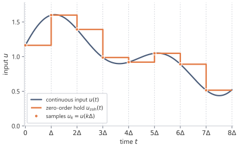

A neural sequence layer sees samples, not a continuous signal. Discretisation turns the continuous state equation into a recurrence indexed by sequence position. The step size and the rule used between samples decide which discrete matrices $\bar A$ and $\bar B$ replace the continuous matrices $A$ and $B$, and therefore which lag weights the sampled model will use.

## 4.1 Why discretisation is needed {#sec-4-1}

In continuous time, the state space model is

$$
x'(t)=Ax(t)+Bu(t),
\qquad
y(t)=Cx(t).
$$

The continuous form is natural for mathematics because differential equations describe continuous evolution. It also reveals the model's memory through the solution

$$
x(t)=\int_0^t e^{A(t-s)}Bu(s)\dd s.
$$

Sequence models usually receive a finite list rather than a continuous function $u(t)$,

$$
u_0,u_1,\dots,u_{L-1}.
$$

A continuous-time model can act on such data only after it has been converted into a discrete update rule. The differential equation is replaced by a recurrence

$$
x_{k+1}=\bar A x_k+\bar B u_k.
$$

The matrices $\bar A$ and $\bar B$ are not new independent parameters in this construction. They are the discrete-time versions of $A$ and $B$, determined by the continuous dynamics, the step size, and the interpolation assumption between samples.

The clock has changed from continuous time to sequence index. The memory mechanism has not: all earlier inputs still act on future outputs only through the current state.

## 4.2 Sampling and the exact one-step formula {#sec-4-2}

Producing such a recurrence begins by fixing the times at which the state is read. Choose a step size

$$
\Delta>0.
$$

The sampled times are

$$
t_k=k\Delta,
\qquad
k=0,1,2,\dots.
$$

Write

$$
x_k=x(t_k).
$$

The input sample $u_k$ is the input value assigned to the interval beginning at $t_k$. The discrete model will process $u_k$ and move the state from $x_k$ to $x_{k+1}$.

The output is read after the input has entered the state:

$$
y_k=Cx_{k+1}.
$$

Reading the output after the update makes the first discrete kernel coefficient equal to the immediate response to the current input.[^discrete-readout-convention]

With the grid fixed, the exact evolution over one interval follows from the continuous solution. The continuous solution over one interval $[t_k,t_{k+1}]$ is

$$
x_{k+1}
=
e^{A\Delta}x_k
+
\int_{t_k}^{t_{k+1}}
e^{A(t_{k+1}-s)}Bu(s)\dd s.
$$

The one-step formula is exact. No approximation has been made yet. Sampling has only selected the endpoints of the intervals; the unresolved part is the input path between those endpoints.

The first term,

$$
e^{A\Delta}x_k,
$$

is the old state propagated forward by one step.

The second term is the accumulated effect of the input during the interval. It is also where the difficulty appears. The integral requires $u(s)$ for every $s$ between $t_k$ and $t_{k+1}$, but sequence data gives only the sample $u_k$.

Therefore discretisation must answer a specific question:

$$\text{What assumption describes the input between two sampled positions?}$$

Different answers give different discretisations.

## 4.3 Holding the input constant between samples {#sec-4-3}

The simplest assumption is to keep the current sample fixed until the next sample arrives:

$$
u(s)=u_k
\qquad
\text{for }s\in[t_k,t_{k+1}).
$$

The assumption is called **zero-order hold**.[^zero-order-hold-reference] The between-sample input is approximated by a polynomial of degree zero, a constant held at the last sampled value.

Substituting this assumption into the exact one-step formula gives

$$
x_{k+1}
=
e^{A\Delta}x_k
+
\left(
\int_{t_k}^{t_{k+1}}
e^{A(t_{k+1}-s)}\dd s
\right)Bu_k.
$$

Change variables to elapsed time within the interval:

$$
\tau=t_{k+1}-s.
$$

As $s$ runs from $t_k$ to $t_{k+1}$, $\tau$ runs from $\Delta$ down to $0$. The integral becomes

$$
\int_0^\Delta e^{A\tau}\dd\tau.
$$

Thus the discrete update has the form

$$
x_{k+1}=\bar A x_k+\bar B u_k
$$

with

$$
\bar A=e^{A\Delta}
$$

and

$$
\bar B=
\left(
\int_0^\Delta e^{A\tau}\dd\tau
\right)B.
$$

If $A$ is invertible, then

$$
\int_0^\Delta e^{A\tau}\dd\tau
=
A^{-1}\left(e^{A\Delta}-I\right),
$$

so

$$
\boxed{
\bar A=e^{A\Delta},
\qquad
\bar B=A^{-1}\left(e^{A\Delta}-I\right)B.
}
$$

The inverse formula is not the best way to understand the expression, because the integral is meaningful even when $A$ is not invertible. To write a version that remains valid in that case, define

$$
\varphi_1(z)=\frac{e^z-1}{z}
=
\sum_{n=0}^\infty \frac{z^n}{(n+1)!}.
$$

Then

$$
\boxed{
\bar B=\Delta\varphi_1(\Delta A)B.
}
$$

The matrix $\bar A$ moves the old state across one interval. The matrix $\bar B$ records how a constant input over that interval accumulates into the state.

Reducing to one dimension gives a check on these formulas and shows what they mean per mode. Suppose $N=1$, and write

$$
A=[a],
\qquad
B=[b].
$$

Identifying $1\times 1$ matrices with their entries,

$$
\bar A=e^{a\Delta},
\qquad
\bar B=\frac{e^{a\Delta}-1}{a}b,
$$

with limiting value

$$
\bar B=\Delta b
$$

when $a=0$.

If $a<0$, then

$$
0<e^{a\Delta}<1.
$$

So a continuous decaying mode remains a discrete decaying mode. The state contracts by the factor $e^{a\Delta}$ at each step.

For small $\Delta$,

$$
e^{a\Delta}=1+a\Delta+O(\Delta^2).
$$

Therefore

$$
\bar A=1+a\Delta+O(\Delta^2),
\qquad
\bar B=\Delta b+O(\Delta^2).
$$

The recurrence becomes

$$
x_{k+1}
=
x_k+\Delta(ax_k+bu_k)+O(\Delta^2).
$$

To first order, this is the forward Euler approximation. Zero-order hold is more precise because it uses the exact exponential transition over the interval under the held-input assumption.

{fig-alt="A smooth input curve, its samples, and the piecewise-constant zero-order-hold staircase." fig-align="center" width="80%"}

## 4.4 A second route via averaged state dynamics {#sec-4-4}

Zero-order hold first makes an assumption about the input, then solves the state dynamics exactly over the interval. Another approach is to approximate the differential equation itself.

Start from

$$
x'(t)=Ax(t)+Bu(t).
$$

Integrating over $[t_k,t_{k+1}]$ gives

$$
x_{k+1}-x_k
=
\int_{t_k}^{t_{k+1}}Ax(t)\dd t
+
\int_{t_k}^{t_{k+1}}Bu(t)\dd t.
$$

The first integral depends on the unknown path $x(t)$ between the endpoints. A natural approximation is to average the vector field at the beginning and end of the interval:

$$
\int_{t_k}^{t_{k+1}}Ax(t)\dd t
\approx
\frac{\Delta}{2}\left(Ax_k+Ax_{k+1}\right).
$$

For the input term, use the same held-input approximation:

$$
\int_{t_k}^{t_{k+1}}Bu(t)\dd t
\approx
\Delta Bu_k.
$$

Then

$$
x_{k+1}-x_k
=
\frac{\Delta}{2}\left(Ax_k+Ax_{k+1}\right)
+
\Delta Bu_k.
$$

Collecting the $x_{k+1}$ terms,

$$
\left(I-\frac{\Delta}{2}A\right)x_{k+1}
=
\left(I+\frac{\Delta}{2}A\right)x_k
+
\Delta Bu_k.
$$

Thus

$$
\boxed{
\bar A
=
\left(I-\frac{\Delta}{2}A\right)^{-1}
\left(I+\frac{\Delta}{2}A\right),
\qquad
\bar B
=
\left(I-\frac{\Delta}{2}A\right)^{-1}\Delta B.
}
$$

The resulting map is the **bilinear transform**, also called the Tustin transform.[^bilinear-tustin-convention]

The two factors of $\bar A$ read as one averaged step. The right factor $I+\frac{\Delta}{2}A$ advances the state by half a step of the explicit forward Euler rule, and the left factor $\left(I-\frac{\Delta}{2}A\right)^{-1}$ completes the step with half a step of the implicit backward Euler rule. The bilinear map averages a forward half-step and a backward half-step, which is why it matches the trapezoidal rule applied to the state dynamics.

The bilinear form differs from zero-order hold in what computing $\bar A$ requires. Zero-order hold sets $\bar A=e^{A\Delta}$, which requires a matrix exponential. The bilinear $\bar A$ instead needs only the linear solve with $I-\frac{\Delta}{2}A$ that defines the inverse factor, with no exponential at all. When $A$ is structured so that this solve is cheap, the bilinear form gives $\bar A$ at a cost the matrix exponential cannot match.

Reducing to one dimension checks the formula and shows its agreement with zero-order hold per mode. For $N=1$ with $A=[a]$, the bilinear eigenvalue is

$$
\mu=\frac{1+\frac{\Delta}{2}a}{1-\frac{\Delta}{2}a}.
$$

Expanding both maps for small $\Delta$ gives

$$
e^{a\Delta}
=
1+a\Delta+\frac{a^2\Delta^2}{2}+\frac{a^3\Delta^3}{6}+O(\Delta^4),
$$

while

$$
\frac{1+\frac{\Delta}{2}a}{1-\frac{\Delta}{2}a}
=
1+a\Delta+\frac{a^2\Delta^2}{2}+\frac{a^3\Delta^3}{4}+O(\Delta^4).
$$

The two maps agree through order $\Delta^2$ and differ at order $\Delta^3$. Zero-order hold carries the exact exponential, while the bilinear map carries the trapezoidal approximation.

## 4.5 Eigenvalues and the step size as a timescale {#sec-4-5}

Both routes produce a matrix $\bar A$ that multiplies each mode by a number at every step, so the question of whether a sampled system stays stable reduces to where those numbers lie. In continuous time, a mode with eigenvalue $\lambda$ decays when

$$
\Real\lambda<0.
$$

In discrete time, a mode is multiplied by some number $\mu$ at each step. It decays when

$$
|\mu|<1.
$$

A good discretisation should preserve this basic stability behaviour. A stable continuous-time system should not become unstable merely because it has been sampled.

For zero-order hold,

$$
\bar A=e^{A\Delta}.
$$

If $\lambda$ is an eigenvalue of $A$, then the corresponding eigenvalue of $\bar A$ is

$$
\mu=e^{\lambda\Delta}.
$$

Its magnitude is

$$
|\mu|
=
e^{(\Real\lambda)\Delta}.
$$

Therefore

$$
|\mu|<1
\qquad\Longleftrightarrow\qquad
\Real\lambda<0.
$$

Zero-order hold preserves the continuous-time stability condition exactly.

For the bilinear transform, the eigenvalue map is

$$
\mu
=
\frac{1+\frac{\Delta}{2}\lambda}
{1-\frac{\Delta}{2}\lambda}.
$$

Write

$$
\lambda=a+ib,
\qquad
\alpha=\frac{\Delta}{2}.
$$

Then

$$
|\mu|^2
=
\frac{(1+\alpha a)^2+(\alpha b)^2}
{(1-\alpha a)^2+(\alpha b)^2}.
$$

If $a<0$, the numerator is smaller than the denominator, so

$$
|\mu|<1.
$$

Thus the bilinear transform also maps the stable continuous-time region into the stable discrete-time region.

The eigenvalue $\mu$ also fixes how much continuous time a single step spans, so the step size $\Delta$ determines how much continuous time passes in one discrete step.

For zero-order hold,

$$
\mu=e^{\lambda\Delta}.
$$

If $\Real\lambda<0$, increasing $\Delta$ makes

$$
|\mu|=e^{(\Real\lambda)\Delta}
$$

smaller. The state forgets more per discrete step.

Decreasing $\Delta$ does the opposite. Each step changes the state less, but more steps fit into the same amount of continuous time.

For sequence models, memory is measured in positions. A continuous mode that decays slowly can still disappear over only a few positions if $\Delta$ is large. Conversely, a smaller $\Delta$ lets the same continuous mode persist over more positions. Changing the step size changes the lag weights used by the discrete model.

The **discrete half-life** of a decaying mode is the number of steps $m_{1/2}$ needed for its magnitude to shrink by a factor of two. If $|\mu|<1$, then

$$
|\mu|^{m_{1/2}}=\frac12,
$$

so

$$
\boxed{
m_{1/2}=\frac{\log 2}{-\log |\mu|}.
}
$$

For zero-order hold, $\mu=e^{\lambda\Delta}$, and therefore

$$
m_{1/2}
=
\frac{1}{\Delta}\frac{\log 2}{-\Real\lambda}.
$$

The continuous half-life is divided by the step size, so a continuous timescale becomes a memory length measured in sequence positions.

Nothing in the mathematics requires one shared step size for all coordinates or all state directions. Here, however, the discretised matrices are fixed once chosen, so the resulting kernel is fixed as well.

The eigenvalue identity $\mu=e^{\lambda\Delta}$ can be checked on a small stable system: discretise with zero-order hold and compare the eigenvalues of $\bar A$ against $e^{\lambda\Delta}$.

```{python}
# shared example: a stable rotation and its predicted discrete eigenvalues
import numpy as np

A = np.array([[-0.3, 1.0], [-1.0, -0.3]])   # a stable decaying rotation
B = np.array([1.0, 0.5])
Delta = 0.5

lam = np.linalg.eigvals(A)                   # continuous eigenvalues
expected = np.exp(lam * Delta)               # predicted discrete eigenvalues
expected = expected[np.argsort(expected.imag)]
```

The continuous eigenvalues $-0.3\pm i$ have negative real part, so each predicted discrete eigenvalue should equal $e^{\lambda\Delta}$ and lie strictly inside the unit disc. Each tab discretises with zero-order hold, sorts the eigenvalues of $\bar A$ by imaginary part, and reports the largest mismatch against $e^{\lambda\Delta}$ together with the largest $|\mu|$.

::: {.panel-tabset}

## NumPy

```{python}
from ssm_book.numpy_ref.discretisation import zoh_discretise

Abar, _ = zoh_discretise(A, B, Delta)
mu = np.linalg.eigvals(Abar)
mu = mu[np.argsort(mu.imag)]
err = float(np.max(np.abs(mu - expected)))
print(f"max |mu - exp(lambda*Delta)| = {err:.1e}")
print(f"max |mu|                     = {float(np.max(np.abs(mu))):.4f}")
```

## PyTorch

```{python}
import torch
from ssm_book.torch_ref.discretisation import zoh_discretise as zoh_t

Abar = zoh_t(A, B, Delta)[0]
mu = torch.linalg.eigvals(Abar).numpy()
mu = mu[np.argsort(mu.imag)]
err = float(np.max(np.abs(mu - expected)))
print(f"max |mu - exp(lambda*Delta)| = {err:.1e}")
print(f"max |mu|                     = {float(np.max(np.abs(mu))):.4f}")
```

## JAX

```{python}
import jax.numpy as jnp
from ssm_book.jax_ref.discretisation import zoh_discretise as zoh_j

Abar = zoh_j(A, B, Delta)[0]
mu = np.asarray(jnp.linalg.eigvals(Abar))
mu = mu[np.argsort(mu.imag)]
err = float(np.max(np.abs(mu - expected)))
print(f"max |mu - exp(lambda*Delta)| = {err:.1e}")
print(f"max |mu|                     = {float(np.max(np.abs(mu))):.4f}")
```

:::

The mismatch sits at the level of floating-point error, so the discrete eigenvalues equal $e^{\lambda\Delta}$, and the largest $|\mu|$ is below one, so the sampled system stays stable. The bilinear transform, exposed as `bilinear_discretise` in the same module, gives a different $\bar A$ but, for this stable system, the same conclusion $|\mu|<1$.

{fig-alt="Two complex planes side by side: the shaded stable left half-plane of continuous eigenvalues maps into the shaded unit disc of discrete eigenvalues. The imaginary axis lands on the unit circle and a marked conjugate pair lands inside the disc." fig-align="center" width="80%"}

## 4.6 From recurrence to kernel {#sec-4-6}

With the discrete matrices fixed, the state equation becomes

$$
x_{k+1}
=
\bar A x_k+\bar B u_k,
\qquad
x_0=0.
$$

Expanding the first few steps,

$$
x_1=\bar B u_0,
$$

$$
x_2=\bar A\bar B u_0+\bar B u_1,
$$

and

$$
x_3=\bar A^2\bar B u_0+\bar A\bar B u_1+\bar B u_2.
$$

The pattern is that an older input has been propagated by more powers of $\bar A$. In general,

$$
x_{k+1}
=
\sum_{j=0}^k
\bar A^{k-j}\bar B u_j.
$$

Reading out with $C$,

$$
y_k
=
\sum_{j=0}^k
C\bar A^{k-j}\bar B u_j.
$$

The coefficient multiplying $u_j$ depends on the lag $k-j$. Define the **discrete kernel**

$$
\boxed{
\bar K_m=C\bar A^m\bar B.
}
$$

Then

$$
\boxed{
y_k
=
\sum_{m=0}^k
\bar K_m u_{k-m}.
}
$$

The formula is the discrete analogue of the continuous convolution. The recurrence carries the state locally; the convolution exposes all lag weights at once. The two forms compute the same map but have different costs and different opportunities for parallelism.

## 4.7 Notation {#sec-4-7}

| Symbol | Meaning | Type |
|---|---|---|
| $\Delta$ | step size | $\R_{>0}$ |
| $t_k$ | sample time $k\Delta$ | $\R_{\ge 0}$ |
| $u_k$ | input sample assigned to $[t_k,t_{k+1})$ | $\R$ |
| $x_k$ | sampled state $x(t_k)$ | $\R^N$ |
| $y_k$ | output after consuming $u_k$ | $\R$ |
| $\bar A$ | discretised state matrix | $\R^{N\times N}$ |
| $\bar B$ | discretised input matrix | $\R^{N\times 1}$ |
| $\mu$ | discrete eigenvalue | $\C$ |
| $\bar K_m$ | discrete kernel coefficient $C\bar A^m\bar B$ | scalar or matrix |
| $\varphi_1(z)$ | function $(e^z-1)/z$ | scalar or matrix function |
| $m_{1/2}$ | discrete half-life of a decaying mode | $\R_{>0}$ |


[^discrete-readout-convention]: If the output is instead read as $Cx_k$, the same dynamics appear with a one-step shift in the discrete kernel. The convention changes the indexing of the immediate response, not the continuous state dynamics.

[^zero-order-hold-reference]: Zero-order hold is the conventional sample-and-hold rule of discrete-time signal processing; the input is kept constant between samples [@oppenheim1999dtsp].

[^bilinear-tustin-convention]: The bilinear, or Tustin, transform comes from analysing a continuous system through the trapezoidal rule [@tustin1947]. In numerical analysis the same update for the homogeneous state equation is the trapezoidal, or Crank--Nicolson, rule. Input-output conventions can move factors between the state update and the readout, but the eigenvalue map for $\bar A$ is unchanged; the map sends the stable left half-plane into the unit disc.


## Summary {.unnumbered}

Discretisation turns the continuous state equation into a sequence recurrence

$$
x_{k+1}=\bar A x_k+\bar B u_k.
$$

Under zero-order hold, the input is assumed constant between samples, giving

$$
\bar A=e^{A\Delta},
\qquad
\bar B=\int_0^\Delta e^{A(\Delta-\tau)}B\,\dd\tau.
$$

The step size $\Delta$ sets the relation between continuous time and sequence positions. Smaller steps keep the discrete dynamics closer to the continuous flow; larger steps compress more continuous time into each update. The bilinear rule gives a rational approximation that maps stable continuous eigenvalues into the unit disc, the stability region for discrete recurrences.

## Exercises {.unnumbered}

1. Take $N=1$ with $A=[a]$ and $B=[b]$ and $a\ne 0$. Starting from the exact one-step formula and the held-input assumption $u(s)=u_k$ on $[t_k,t_{k+1})$, evaluate $\int_0^\Delta e^{a\tau}\dd\tau$ directly and show that $\bar A=e^{a\Delta}$ and $\bar B=\frac{e^{a\Delta}-1}{a}\,b$. Then take the limit $a\to 0$ and recover $\bar B=\Delta b$.

   ::: {.callout-tip collapse="true"}
   ## Solution

   In one dimension the matrix exponential is the scalar exponential, so the propagator is $\bar A=e^{a\Delta}$. With the input held at $u_k$, the change of variable $\tau=t_{k+1}-s$ turns the input term into $\big(\int_0^\Delta e^{a\tau}\dd\tau\big)b\,u_k$. The integrand is a scalar exponential, so

   $$
   \int_0^\Delta e^{a\tau}\dd\tau
   =
   \left[\frac{e^{a\tau}}{a}\right]_0^\Delta
   =
   \frac{e^{a\Delta}-1}{a},
   $$

   which requires only $a\ne 0$. Hence $\bar B=\frac{e^{a\Delta}-1}{a}\,b$. As $a\to 0$, write $e^{a\Delta}-1=a\Delta+\tfrac12 a^2\Delta^2+\dots$, so $(e^{a\Delta}-1)/a=\Delta+\tfrac12 a\Delta^2+\dots\to\Delta$, giving $\bar B=\Delta b$. The limiting value equals $\Delta\varphi_1(\Delta a)b$ at $a=0$, where $\varphi_1(0)=1$.
   :::

2. Take the stable mode $\lambda=-1+2i$ and a step size $\Delta=0.5$. Compute the discrete eigenvalue $\mu=e^{\lambda\Delta}$ for zero-order hold and $\mu=\frac{1+\frac\Delta2\lambda}{1-\frac\Delta2\lambda}$ for the bilinear transform. Report $|\mu|$ for each. Confirm that both satisfy $|\mu|<1$, and decide which map sends the eigenvalue closer to the unit circle.

   ::: {.callout-tip collapse="true"}
   ## Solution

   For zero-order hold, $\mu=e^{\lambda\Delta}=e^{(-1+2i)/2}=e^{-1/2}(\cos 1+i\sin 1)$, with magnitude $|\mu|=e^{(\Real\lambda)\Delta}=e^{-1/2}=0.6065$. For the bilinear transform, with $\tfrac\Delta2\lambda=-0.25+0.5i$,

   $$
   \mu=\frac{1+\tfrac\Delta2\lambda}{1-\tfrac\Delta2\lambda}
   =\frac{0.75+0.5i}{1.25-0.5i},
   $$

   which has magnitude $|\mu|=0.6695$. Both lie strictly inside the unit disc, as they must for a mode with $\Real\lambda<0$. The bilinear value is larger, so it sits closer to the unit circle: the bilinear map does not contract a stable mode as strongly as zero-order hold does.

   ```python
   import numpy as np

   lam, Delta = -1 + 2j, 0.5
   mu_zoh = np.exp(lam * Delta)
   mu_bil = (1 + (Delta / 2) * lam) / (1 - (Delta / 2) * lam)
   print(abs(mu_zoh), abs(mu_bil))   # 0.6065  0.6695
   ```
   :::

3. For zero-order hold and a fixed continuous eigenvalue $\lambda=a+ib$ with $a<0$, write $\mu(\Delta)=e^{\lambda\Delta}$ and show that $|\mu(\Delta)|=e^{a\Delta}$ decreases as $\Delta$ grows. Using the half-life formula $m_{1/2}=\log 2/(-\log|\mu|)$, express $m_{1/2}$ in terms of $\Delta$ and $a$ and explain why halving $\Delta$ doubles the number of positions over which the mode persists.

   ::: {.callout-tip collapse="true"}
   ## Solution

   Since $\mu=e^{\lambda\Delta}=e^{a\Delta}e^{ib\Delta}$ and the second factor has unit modulus, $|\mu(\Delta)|=e^{a\Delta}$. With $a<0$ the exponent $a\Delta$ becomes more negative as $\Delta$ grows, so $|\mu(\Delta)|$ decreases: a larger step forgets more per step. Substituting $\log|\mu|=a\Delta$ into the half-life formula,

   $$
   m_{1/2}
   =\frac{\log 2}{-\log|\mu|}
   =\frac{\log 2}{-a\Delta}
   =\frac{1}{\Delta}\cdot\frac{\log 2}{-a}.
   $$

   The factor $\log 2/(-a)$ is the continuous half-life in time units, fixed by the mode. Dividing by $\Delta$ converts that continuous duration into a count of discrete positions. Halving $\Delta$ doubles $1/\Delta$, so the same continuous half-life now spans twice as many positions: the mode decays the same amount in real time, but that decay is spread over more steps.
   :::

4. Write a function that takes a square matrix $A$ and a step size $\Delta$, calls `zoh_discretise` from `ssm_book.numpy_ref.discretisation`, and returns the spectral radius $\max_i|\mu_i|$ of the resulting $\bar A$. Build a `numpy` test that asserts the spectral radius is strictly less than one whenever every eigenvalue of $A$ has negative real part, and that it equals one when the largest real part of $A$'s eigenvalues is exactly zero (with none positive), as in the undamped rotation. Verify the test on the rotation $A=\begin{pmatrix}-0.3 & 1\\-1 & -0.3\end{pmatrix}$ and on the undamped rotation $A=\begin{pmatrix}0 & 1\\-1 & 0\end{pmatrix}$.

   ::: {.callout-tip collapse="true"}
   ## Solution

   The spectral radius of $\bar A=e^{A\Delta}$ is $\max_i e^{(\Real\lambda_i)\Delta}=e^{(\max_i\Real\lambda_i)\Delta}$, so it is below one exactly when every $\Real\lambda_i<0$ and equals one when the largest real part is exactly zero (a purely imaginary eigenvalue with none further right); a positive real part would push it above one. The damped rotation has eigenvalues $-0.3\pm i$, giving spectral radius $e^{-0.3\Delta}$; at $\Delta=0.5$ this is $e^{-0.15}=0.860708$. The undamped rotation has eigenvalues $\pm i$, so its spectral radius is $e^{0}=1$ for every $\Delta$.

   ```python
   import numpy as np
   from ssm_book.numpy_ref.discretisation import zoh_discretise


   def spectral_radius(A, Delta):
       A = np.asarray(A, dtype=float)
       Abar, _ = zoh_discretise(A, np.zeros((A.shape[0], 1)), Delta)
       return float(np.max(np.abs(np.linalg.eigvals(Abar))))


   def test_zoh_stability():
       stable = np.array([[-0.3, 1.0], [-1.0, -0.3]])
       undamped = np.array([[0.0, 1.0], [-1.0, 0.0]])
       assert spectral_radius(stable, 0.5) < 1.0
       assert abs(spectral_radius(undamped, 0.5) - 1.0) < 1e-12
   ```

   At $\Delta=0.5$ the stable matrix returns $0.860708$, matching $e^{-0.15}$ to floating-point error, and the undamped matrix returns $1.0$ to within floating-point tolerance. The strict inequality holds for the damped rotation, while the purely imaginary spectrum sits on the unit circle, the boundary between decay and growth.
   :::
