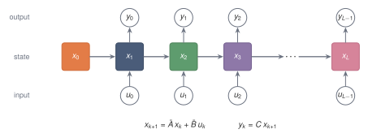
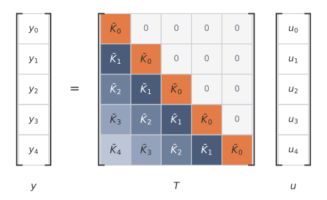

After discretisation, the model can be run left to right as a recurrence. If the matrices do not change with position, the same input-output map can also be written as a convolution.[^discrete-convolution-reference] The kernel records the effect of each input after each lag, and the Toeplitz matrix records the same map on a finite sequence. The obstruction is no longer whether the kernel exists, but whether it can be generated and applied cheaply.

## 5.1 The question after discretisation {#sec-5-1}

After discretisation, the state space model becomes the recurrence

$$
x_{k+1}
=
\bar A x_k+\bar B u_k,
\qquad
y_k=Cx_{k+1}.
$$

The displayed equations give a recurrent computation. Starting from $x_0$, the sequence is read from left to right, and the state is updated one step at a time.

Because the matrices $\bar A$, $\bar B$, and $C$ are fixed across time, the same model can also be written as a convolution. Instead of carrying the state explicitly, one precomputes a kernel that records how much an input affects the output after $0$ steps, $1$ step, $2$ steps, and so on.

The same input-output map has two computational forms:

$$
\text{recurrence:}
\qquad
x_{k+1}=\bar A x_k+\bar B u_k,
$$

and

$$
\text{convolution:}
\qquad
y_k=\sum_{m=0}^k \bar K_m u_{k-m}.
$$

They compute the same input-output map. They differ in the order of computation, and therefore in cost and parallelism.

No parameter has changed in the rewrite. The recurrence keeps the hidden state as a running variable; the convolution eliminates it and stores its effect in the lag coefficients.

{fig-alt="A chain of state boxes with inputs entering and outputs leaving at each step." fig-align="center" width="80%"}

## 5.2 From the recurrence to a convolution {#sec-5-2}

Fix a finite input sequence to work with. Let the input sequence have length $L$:

$$
u_0,u_1,\dots,u_{L-1}.
$$

Each $u_k$ is scalar. A $\dmodel$-dimensional representation is handled by applying one scalar state space model to each coordinate, unless a MIMO state space model is explicitly used.

The recurrence is

$$
x_{k+1}
=
\bar A x_k+\bar B u_k,
\qquad
k=0,\dots,L-1,
$$

with

$$
x_0=0.
$$

The output after consuming $u_k$ is

$$
y_k=Cx_{k+1}.
$$

The recurrence form computes $x_1,x_2,\dots,x_L$ in order. It is the most direct way to use the state.

To see the convolution hidden inside the recurrence, expand the first few states.

The first input gives

$$
x_1=\bar B u_0.
$$

After the second input,

$$
x_2
=
\bar A x_1+\bar B u_1
=
\bar A\bar B u_0+\bar B u_1.
$$

After the third input,

$$
x_3
=
\bar A x_2+\bar B u_2
=
\bar A^2\bar B u_0+\bar A\bar B u_1+\bar B u_2.
$$

Each input enters through $\bar B$. Then, as time passes, it is propagated through powers of $\bar A$. An input from farther in the past receives more powers of $\bar A$.

In general,

$$
x_{k+1}
=
\sum_{j=0}^k
\bar A^{k-j}\bar B u_j.
$$

Applying $C$ gives

$$
y_k
=
\sum_{j=0}^k
C\bar A^{k-j}\bar B u_j.
$$

The coefficient of $u_j$ depends only on the lag

$$
k-j.
$$

The difference $k-j$ is the discrete version of the continuous lag $t-s$.

Define

$$
\boxed{
\bar K_m=C\bar A^m\bar B.
}
$$

Then

$$
\boxed{
y_k
=
\sum_{m=0}^k
\bar K_m u_{k-m}.
}
$$

The formula is causal discrete convolution. The output $y_k$ uses only the inputs $u_0,\dots,u_k$.

For a MIMO state space model, the same definition gives

$$
\bar K_m=C\bar A^m\bar B\in\R^{q\times p},
$$

and the convolution is matrix-vector convolution:

$$
y_k
=
\sum_{m=0}^k
\bar K_m u_{k-m},
\qquad
u_{k-m}\in\R^p,
\quad
y_k\in\R^q.
$$

## 5.3 What the discrete kernel means {#sec-5-3}

The kernel coefficient

$$
\bar K_m=C\bar A^m\bar B
$$

has a direct interpretation.

An input first enters the state through $\bar B$. After $m$ steps, that contribution has been propagated by $\bar A^m$. The output map $C$ then reads the result.

Thus $\bar K_m$ is the effect of an input after $m$ discrete steps.

The first few coefficients are

$$
\bar K_0=C\bar B,
$$

$$
\bar K_1=C\bar A\bar B,
$$

and

$$
\bar K_2=C\bar A^2\bar B.
$$

The sequence

$$
\bar K_0,\bar K_1,\dots,\bar K_{L-1}
$$

is the discrete impulse response of the model over a length-$L$ sequence.

The coefficient $\bar K_0$ is nonzero because the output is read from the updated state. The current input $u_k$ enters the state through $\bar B$, and the output $y_k$ is read from the updated state $x_{k+1}$.

The discrete kernel is the continuous impulse response $h(\tau)=Ce^{A\tau}B$ sampled in time. Under zero-order hold the discrete transition matrix is $\bar A=e^{A\Delta}$, so its powers are

$$
\bar A^m=e^{Am\Delta}.
$$

The kernel coefficient then reads

$$
\bar K_m=C\bar A^m\bar B=Ce^{Am\Delta}\bar B,
$$

which is the continuous impulse response evaluated at the lag $m\Delta$, with $\bar B$ in place of $B$ to account for what the input does during one interval. The discrete kernel therefore samples a hold-modified copy of $h$ at the lags $0,\Delta,2\Delta,\dots$.

Take a decaying-rotation system, with

$$
A=
\begin{pmatrix}
-0.3 & 1\\
-1 & -0.3
\end{pmatrix},
\quad
\bar B=A^{-1}(\bar A-I)B,
\quad
\Delta=0.5,
$$

and $B=(1,0.5)^\top$, $C=(1,-1)$. The first few coefficients are

$$
\bar K_0,\bar K_1,\dots\approx 0.39,\ 0.55,\ 0.54,\ 0.41,\ 0.22,\ 0.03,\ -0.12,\dots,
$$

which rise, then decay, and later change sign. The decay comes from the magnitude of $\bar A$, and the sign change comes from the rotation contributed by the imaginary parts of its eigenvalues.

The decay is general. The eigenvalues of $\bar A$ here have magnitude about $0.86$, so they lie inside the unit disc. When every eigenvalue of $\bar A$ satisfies $|\lambda|<1$, the powers $\bar A^m$ shrink and

$$
\bar K_m\to 0
\qquad
\text{as }m\to\infty.
$$

A kernel that fades to zero is fading memory written in discrete form. Distant inputs receive vanishing weight, the same fading measured by the continuous half-life of [Section 3.3](02-continuous-time.qmd#sec-3-3), now read off the discrete lags $m\Delta$.

## 5.4 The convolution matrix {#sec-5-4}

The convolution form can be written as a matrix multiplication, which makes the structure of the operation visible.

Let

$$
u=
\begin{pmatrix}
u_0\\
u_1\\
\vdots\\
u_{L-1}
\end{pmatrix},
\qquad
y=
\begin{pmatrix}
y_0\\
y_1\\
\vdots\\
y_{L-1}
\end{pmatrix}.
$$

Then

$$
y=Tu,
$$

where

$$
T=
\begin{pmatrix}
\bar K_0 & 0 & 0 & \cdots & 0\\
\bar K_1 & \bar K_0 & 0 & \cdots & 0\\
\bar K_2 & \bar K_1 & \bar K_0 & \cdots & 0\\
\vdots & \vdots & \vdots & \ddots & \vdots\\
\bar K_{L-1} & \bar K_{L-2} & \bar K_{L-3} & \cdots & \bar K_0
\end{pmatrix}.
$$

The matrix is lower triangular because the model is causal. Entries above the diagonal would mean that an output depends on future inputs, and those entries are zero.

The matrix is **Toeplitz** because each diagonal is constant.[^toeplitz-orientation] Equal lags have equal weights. Time-invariance appears in matrix form as constant diagonals.

In the MIMO case, the same object is a block lower-triangular Toeplitz matrix. Each scalar entry $\bar K_m$ is replaced by a $q\times p$ block.

{fig-alt="A lower-triangular Toeplitz matrix with equal diagonals shaded equally." fig-align="center" width="80%"}

## 5.5 Why a fixed kernel requires time-invariance {#sec-5-5}

The fixed kernel exists because the same matrices are used at every step:

$$
\bar A,
\qquad
\bar B,
\qquad
C.
$$

The contribution of $u_j$ to $y_k$ is

$$
C\bar A^{k-j}\bar B u_j.
$$

The dependence is only on $k-j$, the number of steps between the input and the output.

If the matrices changed with time, the situation would be different. Suppose

$$
x_{k+1}
=
\bar A_kx_k+\bar B_ku_k,
\qquad
y_k=C_kx_{k+1}.
$$

Then the contribution of $u_j$ to $y_k$ would be

$$
C_k
\bar A_k
\bar A_{k-1}
\cdots
\bar A_{j+1}
\bar B_j u_j.
$$

The coefficient depends on all the matrices between times $j$ and $k$. It therefore depends on the input position itself, not just on the lag.

If the sequence of matrices $\bar A_k,\bar B_k,C_k$ is fixed in advance, the model is still linear in the input sequence. Its input-output matrix is lower triangular, because the system is still causal, but it is not Toeplitz. Equal lags need not have equal weights.

If the matrices are functions of the input sequence itself, then the input helps determine the coefficients multiplying the input. In that case the model no longer represents one fixed linear map from $u$ to $y$. There is still a recurrence, but not a fixed convolution kernel.

## 5.6 Cost of recurrence and convolution {#sec-5-6}

The recurrence computes

$$
x_{k+1}
=
\bar A x_k+\bar B u_k
$$

for $k=0,\dots,L-1$.

If $\bar A$ is dense, then multiplying $\bar A x_k$ costs $O(N^2)$ operations per step. Over $L$ steps, the cost is

$$
O(LN^2).
$$

If $\bar A$ is diagonal, then the multiplication costs $O(N)$ per step, so the total cost is

$$
O(LN).
$$

The recurrence needs only the current state, $O(N)$ numbers, and the next input. That makes it natural for streaming or generation.

The direct recurrence has a time dependency chain. To compute $x_{k+1}$, it uses $x_k$. To compute $x_k$, it uses $x_{k-1}$. Written in this form, the computation follows

$$
x_0\to x_1\to x_2\to\cdots\to x_L.
$$

That statement is about the direct left-to-right algorithm. Special algebraic structure can sometimes give a different algorithm for the same recurrence.

The convolution form removes that dependency chain at the price of forming and applying a kernel. The convolution form is

$$
y_k
=
\sum_{m=0}^k
\bar K_m u_{k-m}.
$$

Computing this directly costs

$$
1+2+\cdots+L
=
\frac{L(L+1)}{2}
$$

multiply-adds per scalar coordinate, which is

$$
O(L^2).
$$

Direct convolution is not the useful algorithmic form. Convolution can be computed by the **fast Fourier transform** (**FFT**).[^fft-convolution-reference]

For two finite sequences, linear convolution is computed by zero-padding both sequences, taking Fourier transforms, multiplying pointwise in frequency space, and applying the inverse Fourier transform. The zero-padding matters because the Fourier transform computes circular convolution. Padding to length at least $2L-1$ makes the circular result agree with the linear one.

The FFT computes these transforms in roughly

$$
O(L\log L)
$$

time.

Thus, once the kernel is available, the convolution form can process a full sequence with much more parallelism across positions than the recurrence.


## 5.7 The kernel-generation problem {#sec-5-7}

The convolution has only moved the expensive object. The kernel itself must still be generated. The kernel is

$$
\bar K_m=C\bar A^m\bar B,
\qquad
m=0,\dots,L-1.
$$

A direct way to form it is to define

$$
v_0=\bar B,
\qquad
v_{m+1}=\bar A v_m,
$$

and then compute

$$
\bar K_m=Cv_m.
$$

If $\bar A$ is dense, each multiplication $\bar A v_m$ costs $O(N^2)$. Generating $L$ kernel values then costs

$$
O(LN^2).
$$

If $\bar A$ is diagonal, kernel generation costs

$$
O(LN).
$$

A dense matrix couples all $N$ state coordinates but costs $O(LN^2)$ to generate the kernel. A diagonal matrix costs $O(LN)$ but evolves each coordinate independently, so it cannot mix them.

The gap between the two is the factor $N$. At representative sizes, with $N=64$ and $L=4096$, dense kernel generation needs about $4096\times 64^2\approx 1.7\times 10^7$ multiply-adds, while diagonal generation needs about $4096\times 64\approx 2.6\times 10^5$. The dense form does $N=64$ times the work.

The diagonal form is cheap for a structural reason. Powers of a diagonal matrix act coordinate-wise, raising each diagonal entry to the same power, so every mode evolves on its own and never exchanges information with the others. These are the independent eigenvalue modes of [Section 3.3](02-continuous-time.qmd#sec-3-3), now frozen onto the coordinate axes. A diagonal $\bar A$ keeps each mode but loses any coupling between them.

Structured state space models try to keep the memory behaviour of a dense-like $A$, where modes can interact, while generating the kernel at a cost near the diagonal $O(LN)$ rather than the dense $O(LN^2)$. The matrix $A$ must therefore be expressive enough for memory and structured enough for kernel generation.

## 5.8 Same model, two algorithms {#sec-5-8}

The recurrence and convolution are not different models. The convolution was obtained by unrolling the recurrence, so both compute the same input-output map.

In recurrence form, the state is explicit:

$$
x_{k+1}
=
\bar A x_k+\bar B u_k.
$$

In convolution form, the state is eliminated from the computation:

$$
y_k
=
\sum_{m=0}^k
\bar K_m u_{k-m}.
$$

The state still exists mathematically. The convolution has summed over all the ways past inputs would have entered and evolved through the state.

The recurrence-convolution equivalence gives two algorithms for one map. The recurrent algorithm is local in time and keeps only the current state. The convolutional algorithm removes the state and exposes all lag weights at once. Which form to use depends on the computation required.

For streaming or generation, the recurrence is natural. The model stores a state, receives the next input, updates the state, and produces the next output. It does not need to store the whole input history.

For full-sequence training, the convolution form can be preferable. If the kernel can be generated in time close to $O(LN)$, the whole sequence can be processed with $O(L\log L)$ FFT-based convolution.

The trade-off is therefore:

- recurrence avoids forming the kernel, but the direct algorithm follows a time dependency chain;
- convolution parallelises across the sequence, but requires the kernel;
- the cost of the kernel depends on the structure of $\bar A$.

The choice of the state matrix matters because $A$ determines both the memory modes and the cost of kernel generation. A useful $A$ must carry memory while keeping the associated computations cheap.

The recurrence and the convolution compute the same output. For a small
two-dimensional system, running it as a recurrence and convolving the input with
its kernel agree up to floating-point error. The NumPy, PyTorch, and JAX implementations
all reproduce the same comparison.

```{python}
# shared example: a small two-dimensional system, discretised once
import numpy as np
from ssm_book.numpy_ref.discretisation import zoh_discretise

A = np.array([[-0.3, 1.0], [-1.0, -0.3]])   # a decaying rotation
B = np.array([1.0, 0.5])
C = np.array([1.0, -1.0])
Abar, Bbar = zoh_discretise(A, B, dt=0.5)
u = np.cos(np.arange(32) * 0.4)
```

Each library runs the system as a recurrence, convolves the input with its kernel, and reports the largest difference:

::: {.panel-tabset}

## NumPy

```{python}
from ssm_book.numpy_ref.kernels import ssm_recurrence, ssm_kernel, causal_conv

y_rec = ssm_recurrence(Abar, Bbar, C, u)
y_conv = causal_conv(ssm_kernel(Abar, Bbar, C, len(u)), u)
err = float(np.max(np.abs(y_rec - y_conv)))
print(f"max |recurrence - convolution| = {err:.1e}")
```

## PyTorch

```{python}
import torch
from ssm_book.torch_ref.kernels import (
    ssm_recurrence as rec_t, ssm_kernel as ker_t, causal_conv as conv_t)

y_rec = rec_t(Abar, Bbar, C, u)
y_conv = conv_t(ker_t(Abar, Bbar, C, len(u)), u)
err = float(torch.max(torch.abs(y_rec - y_conv)))
print(f"max |recurrence - convolution| = {err:.1e}")
```

## JAX

```{python}
import jax.numpy as jnp
from ssm_book.jax_ref.kernels import (
    ssm_recurrence as rec_j, ssm_kernel as ker_j, causal_conv as conv_j)

y_rec = rec_j(Abar, Bbar, C, u)
y_conv = conv_j(ker_j(Abar, Bbar, C, len(u)), u)
err = float(jnp.max(jnp.abs(y_rec - y_conv)))
print(f"max |recurrence - convolution| = {err:.1e}")
```

:::

## 5.9 Notation {#sec-5-9}

| Symbol | Meaning | Type |
|---|---|---|
| $L$ | sequence length | positive integer |
| $u=(u_0,\dots,u_{L-1})$ | input sequence | $\R^L$ in the SISO case |
| $y=(y_0,\dots,y_{L-1})$ | output sequence | $\R^L$ in the SISO case |
| $\bar K_m$ | discrete kernel coefficient $C\bar A^m\bar B$ | scalar or matrix |
| $\bar K$ | kernel sequence | length-$L$ sequence |
| $T$ | lower-triangular Toeplitz convolution matrix | $\R^{L\times L}$ in the SISO case |
| $v_m$ | state response vector $\bar A^m\bar B$ | $\R^N$ or $\R^{N\times p}$ |


[^discrete-convolution-reference]: The recurrence and convolution forms are standard in discrete-time signal processing and follow directly from unrolling the recurrence. The lower-triangular Toeplitz structure of a causal, time-invariant convolution, and the kernel interpretation of the impulse response, are treated in standard accounts of discrete-time signal processing [@oppenheim1999dtsp].

[^toeplitz-orientation]: Some texts place the same lag pattern in an upper-triangular matrix, depending on whether signals are written as row or column vectors and on the indexing convention for convolution. The invariant property is that equal lags lie on equal diagonals.

[^fft-convolution-reference]: The observation that convolution can be evaluated through the fast Fourier transform, which makes the convolution form cheaper than the direct $O(L^2)$ sum, goes back to Cooley and Tukey [@cooley1965fft].


## Summary {.unnumbered}

A discrete linear time-invariant state space model can be run as

$$
x_{k+1}=\bar A x_k+\bar B u_k
$$

or written as the convolution

$$
y_k=\sum_{m=0}^k \bar K_m u_{k-m},
\qquad
\bar K_m=C\bar A^m\bar B.
$$

The recurrence exposes the online computation. The convolution exposes the full input-output map and allows parallel application once the kernel is known.

For a finite sequence, the convolution is a lower-triangular Toeplitz matrix: causality makes it lower triangular, and time-invariance makes equal lags share equal diagonals. The remaining computational problem is kernel generation. Dense powers of $\bar A$ cost $O(LN^2)$, while diagonal dynamics cost $O(LN)$ but restrict how modes interact.

## Exercises {.unnumbered}

1. Take $x_0=0$ and unroll the recurrence $x_{k+1}=\bar A x_k+\bar B u_k$ by hand for $L=4$. Write $x_1,x_2,x_3,x_4$ as sums of terms $\bar A^{k-j}\bar B u_j$, and read off the coefficient of each $u_j$ in $y_k=Cx_{k+1}$. Confirm that every coefficient depends only on the lag $k-j$.

   ::: {.callout-tip collapse="true"}
   ## Solution

   Starting from $x_0=0$ and applying the recurrence,
   $$
   x_1=\bar B u_0,
   $$
   $$
   x_2=\bar A\bar B u_0+\bar B u_1,
   $$
   $$
   x_3=\bar A^2\bar B u_0+\bar A\bar B u_1+\bar B u_2,
   $$
   $$
   x_4=\bar A^3\bar B u_0+\bar A^2\bar B u_1+\bar A\bar B u_2+\bar B u_3.
   $$
   Reading $y_k=Cx_{k+1}$, the coefficient of $u_j$ in $y_k$ is $C\bar A^{k-j}\bar B$. For $y_3$ these are $C\bar A^3\bar B,\,C\bar A^2\bar B,\,C\bar A\bar B,\,C\bar B$ for $j=0,1,2,3$. Each coefficient carries exactly $k-j$ powers of $\bar A$, the number of steps between the input at $j$ and the output at $k$, so it depends on the lag alone and not on $j$ and $k$ separately.
   :::

2. The kernel coefficient is $\bar K_m=C\bar A^m\bar B$. Starting from the unrolled output $y_k=\sum_{j=0}^k C\bar A^{k-j}\bar B u_j$, substitute $m=k-j$ to derive the convolution $y_k=\sum_{m=0}^k\bar K_m u_{k-m}$, and state which range of $m$ contributes to $y_k$ and why no term with $m>k$ appears.

   ::: {.callout-tip collapse="true"}
   ## Solution

   Set $m=k-j$, so $j=k-m$. As $j$ runs over $0,\dots,k$, the lag $m$ runs over $k,\dots,0$, that is over $0,\dots,k$. The summand $C\bar A^{k-j}\bar B u_j$ becomes $C\bar A^m\bar B\,u_{k-m}=\bar K_m u_{k-m}$, giving
   $$
   y_k=\sum_{m=0}^k\bar K_m u_{k-m}.
   $$
   Only $m=0,\dots,k$ contributes. A term with $m>k$ would correspond to $j=k-m<0$, an input before the start of the sequence; with $x_0=0$ there is no such input. Equivalently, $y_k$ uses only $u_0,\dots,u_k$, so the output is causal.
   :::

3. For a scalar kernel sequence $\bar K_0,\dots,\bar K_4$, write out the length-$5$ matrix $T$ with $T_{ij}=\bar K_{i-j}$ for $i\ge j$ and $T_{ij}=0$ otherwise. Verify that $T$ is lower triangular and that each of its diagonals is constant, and identify which kernel coefficient sits on the main diagonal.

   ::: {.callout-tip collapse="true"}
   ## Solution

   With rows and columns indexed from $0$ to $4$,
   $$
   T=
   \begin{pmatrix}
   \bar K_0 & 0 & 0 & 0 & 0\\
   \bar K_1 & \bar K_0 & 0 & 0 & 0\\
   \bar K_2 & \bar K_1 & \bar K_0 & 0 & 0\\
   \bar K_3 & \bar K_2 & \bar K_1 & \bar K_0 & 0\\
   \bar K_4 & \bar K_3 & \bar K_2 & \bar K_1 & \bar K_0
   \end{pmatrix}.
   $$
   The entries above the diagonal have $i<j$, hence index $i-j<0$, and are set to zero, so $T$ is lower triangular. Along any diagonal the difference $i-j$ is constant, so $T_{ij}=\bar K_{i-j}$ is the same on each diagonal. The main diagonal has $i=j$ and carries $\bar K_0$.
   :::

4. Discretise the two-dimensional system of @sec-5-8 with `zoh_discretise`, form the kernel with `ssm_kernel`, and run both `ssm_recurrence` and `causal_conv` on an input of your choice. Report the maximum absolute difference between the two outputs, and check that building $T$ with `toeplitz` and computing $T u$ reproduces the same result.

   ::: {.callout-tip collapse="true"}
   ## Solution

   The recurrence, the direct convolution, and the matrix product $Tu$ all evaluate the same map, so they agree up to floating-point error.

   ```python
   import numpy as np
   from ssm_book.numpy_ref.discretisation import zoh_discretise
   from ssm_book.numpy_ref.kernels import (
       ssm_recurrence, ssm_kernel, causal_conv, toeplitz)

   A = np.array([[-0.3, 1.0], [-1.0, -0.3]])
   B = np.array([1.0, 0.5])
   C = np.array([1.0, -1.0])
   Abar, Bbar = zoh_discretise(A, B, dt=0.5)
   u = np.cos(np.arange(32) * 0.4)

   K = ssm_kernel(Abar, Bbar, C, len(u))
   y_rec = ssm_recurrence(Abar, Bbar, C, u)
   y_conv = causal_conv(K, u)
   T = toeplitz(K, len(u))

   print(np.max(np.abs(y_rec - y_conv)))        # convolution
   print(np.max(np.abs(y_rec - T @ u.astype(complex))))  # Toeplitz product
   ```

   The convolution differs from the recurrence by about $9\times 10^{-16}$, and $Tu$ by about $1\times 10^{-15}$. Both are at the level of double-precision rounding, confirming that the three routes compute one and the same output.
   :::

5. Replace the fixed matrix $\bar A$ by a time-varying sequence $\bar A_k$, so that the contribution of $u_j$ to $y_k$ becomes $C_k\bar A_k\bar A_{k-1}\cdots\bar A_{j+1}\bar B_j u_j$. Explain why this contribution generally depends on $j$ and $k$ separately rather than on the lag $k-j$ alone, and hence why the convolution matrix remains lower triangular but is no longer Toeplitz.

   ::: {.callout-tip collapse="true"}
   ## Solution

   In the fixed case the product $\bar A_k\cdots\bar A_{j+1}$ collapses to $\bar A^{k-j}$, because every factor is the same matrix and the count of factors is the lag. With time-varying matrices the factors are the specific matrices $\bar A_{j+1},\dots,\bar A_k$, so the product names the actual times between $j$ and $k$, not merely how many of them there are. Shifting both indices by the same amount, $j\mapsto j+1$ and $k\mapsto k+1$, replaces this product by $\bar A_{k+1}\cdots\bar A_{j+2}$, a different ordered product, and the read-in $\bar B_j$ and read-out $C_k$ change too. The coefficient therefore depends on the pair $(j,k)$ and not on $k-j$ alone. The system is still causal: when $j>k$ the product is empty and the contribution is zero, so the matrix stays lower triangular. But equal lags no longer carry equal entries, so the diagonals are not constant and the matrix is not Toeplitz.
   :::
