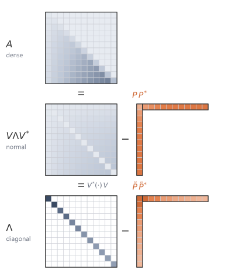

The HiPPO matrix gives the state a memory interpretation, but its dense form is too expensive for long kernels. Direct diagonalisation would make powers and resolvents cheap, but the eigenvector basis is numerically ill conditioned. The S4 construction uses a nearby normal matrix plus a low-rank correction, preserving the useful spectrum while making the resolvent cheap to evaluate.

## 9.1 The cost of density {#sec-9-1}

The HiPPO construction gives a state matrix with a memory interpretation:

$$
A_{\HiPPO}=-H_N.
$$

It does not by itself give a fast kernel algorithm.

The matrix $H_N$ is dense below the diagonal. Multiplying it by a vector costs

$$
\bigO(N^2).
$$

After discretisation, the kernel is

$$
\Kbar_m=C\Abar^m\Bbar,
\qquad
m=0,\dots,L-1.
$$

Generating this kernel by repeated multiplication with a dense $\Abar$ costs

$$
\bigO(LN^2).
$$

A useful representation must keep the memory structure of HiPPO while making long-sequence kernel generation cheap.

## 9.2 Why diagonalisation would help {#sec-9-2}

If the state matrix were diagonal,

$$
A=\diag(\lambda_0,\dots,\lambda_{N-1}),
$$

then applying $A$ to a vector would cost only $\bigO(N)$:

$$
(Ax)_n=\lambda_n x_n.
$$

The matrix exponential would also be diagonal:

$$
e^{At}
=
\diag(e^{\lambda_0t},\dots,e^{\lambda_{N-1}t}).
$$

The resolvent would be diagonal:

$$
(sI-A)^{-1}
=
\diag\left(
\frac{1}{s-\lambda_0},
\dots,
\frac{1}{s-\lambda_{N-1}}
\right).
$$

Diagonal form is attractive because it turns matrix operations into coordinatewise scalar operations.

For a general diagonalisable matrix,

$$
A=V\Lambda V^{-1},
$$

one can also work in eigenvector coordinates. But this is useful only if the change of coordinates is well conditioned. If $V$ is nearly singular, the diagonal representation may be numerically unstable even though it is algebraically correct.

The HiPPO matrix has this conditioning problem. In exact arithmetic $A_{\HiPPO}$ is diagonalisable, so a matrix $V$ of eigenvectors exists. The condition number of that $V$ grows exponentially with the state dimension $N$, so $V$ becomes severely ill-conditioned even at moderate $N$. The diagonal representation is algebraically correct but numerically unusable, and forming the kernel through it loses most of its significant digits. The obstruction is not diagonalisation in principle; it is the floating-point conditioning of the change of coordinates. S4 avoids this by diagonalising a nearby normal matrix whose eigenvectors are well behaved.[^s4-nplr-reference]

The S4 construction uses a more favourable fact. The dense HiPPO matrix is close to a matrix that is diagonalisable by a unitary change of coordinates, and differs from it only by a small-rank correction.

## 9.3 Stable diagonalisation and cheap corrections {#sec-9-3}

The conditioning problem disappears for a special class of matrices. A complex matrix $M\in\C^{N\times N}$ is called **normal** if

$$
MM^*=M^*M,
$$

where $M^*$ is the conjugate transpose.

Normal matrices are useful because they are unitarily diagonalisable. There exists a unitary matrix $V$ and a diagonal matrix $\Lambda$ such that

$$
M=V\Lambda V^*.
$$

A matrix $V$ is **unitary** if

$$
V^*V=VV^*=I.
$$

A unitary change of coordinates preserves lengths and avoids the conditioning problem that can occur with an arbitrary diagonalisation

$$
M=S\Lambda S^{-1}.
$$

Thus a normal matrix may be dense in the original coordinates, but it behaves like a diagonal matrix after a stable change of basis.

A normal matrix alone is not enough, because $A_{\HiPPO}$ is not normal. The discrepancy turns out to have small rank, and a small-rank matrix is itself cheap to apply. A rank-$r$ matrix can be written as

$$
PQ^*,
$$

where

$$
P,Q\in\C^{N\times r}.
$$

If $r\ll N$, then multiplying this matrix by a vector is cheap:

$$
PQ^*v=P(Q^*v).
$$

The vector $Q^*v$ has only $r$ entries, and then $P$ maps it back to $N$ entries. The cost is

$$
\bigO(Nr)
$$

rather than $\bigO(N^2)$.

A dense matrix can sometimes be written as a simple matrix plus a low-rank correction. In S4, the useful simple matrix is normal. A matrix of the form

$$
A=M-PQ^*
$$

with $M$ normal and $P,Q$ low-rank factors is called **normal plus low rank** (**NPLR**).[^nplr-sign-convention]

## 9.4 The HiPPO matrix is normal plus rank one {#sec-9-4}

The HiPPO-LegS matrix fits this template with the smallest possible correction. Use zero-based indexing, so

$$
n=0,1,\dots,N-1.
$$

For the HiPPO-LegS matrix, define two vectors

$$
p_n=\frac{1}{2}\sqrt{2n+1},
\qquad
q_n=\sqrt{2n+1}.
$$

Let

$$
p=(p_0,\dots,p_{N-1})^\top,
\qquad
q=(q_0,\dots,q_{N-1})^\top.
$$

Form

$$
S=A_{\HiPPO}+pq^\top.
$$

To see that this combination is well structured, use the entries of the HiPPO matrix. With $A_{\HiPPO}=-H_N$,

$$
(A_{\HiPPO})_{nk}
=
\begin{cases}
-\sqrt{(2n+1)(2k+1)}, & n>k,\\
-(n+1), & n=k,\\
0, & n<k,
\end{cases}
$$

and the correction has entries $(pq^\top)_{nk}=p_nq_k=\tfrac12\sqrt{(2n+1)(2k+1)}$. Adding the two gives the entries of $S$. For $n>k$ the entry is $-\tfrac12\sqrt{(2n+1)(2k+1)}$, for $n<k$ it is $+\tfrac12\sqrt{(2n+1)(2k+1)}$, and on the diagonal it is $-(n+1)+\tfrac12(2n+1)=-\tfrac12$. Read $S+S^\top$ entry by entry. Off the diagonal the pair $S_{nk}+S_{kn}$ adds $-\tfrac12\sqrt{(2n+1)(2k+1)}$ to its mirror $+\tfrac12\sqrt{(2n+1)(2k+1)}$ and cancels. On the diagonal the two equal entries sum to $-1$. So

$$
S+S^\top=-I.
$$

Thus the symmetric part of $S$ is

$$
-\frac{1}{2}I,
$$

and the remaining part is skew-symmetric, meaning a matrix $K$ with $K^\top=-K$.

A real skew-symmetric matrix shifted by a scalar multiple of the identity is normal. To check this, write $M=\alpha I+K$ with $K^\top=-K$. Then $M^\top=\alpha I-K$, and since $\alpha I$ commutes with $K$,

$$
MM^\top=(\alpha I+K)(\alpha I-K)=\alpha^2 I-K^2=(\alpha I-K)(\alpha I+K)=M^\top M.
$$

Here $S=-\tfrac12 I+K$ with $K$ the skew-symmetric part, so $S$ is normal, and

$$
\boxed{
A_{\HiPPO}=S-pq^\top.
}
$$

The HiPPO matrix is dense, but it is not an arbitrary dense matrix. It differs from a normal matrix by a rank-one correction, which makes the structured S4 construction possible.

Because $S$ is normal, it has a unitary diagonalisation

$$
S=V\Lambda V^*.
$$

Substituting into

$$
A_{\HiPPO}=S-pq^\top
$$

gives

$$
A_{\HiPPO}
=
V\Lambda V^*-pq^\top.
$$

Change state coordinates by

$$
z=V^*x,
\qquad
x=Vz.
$$

Then the state equation

$$
x'(t)=A_{\HiPPO}x(t)+Bu(t)
$$

becomes

$$
z'(t)
=
V^*A_{\HiPPO}Vz(t)+V^*Bu(t).
$$

The transformed state matrix is

$$
V^*A_{\HiPPO}V
=
\Lambda-(V^*p)(V^*q)^*.
$$

The conjugate transpose appears because $q$ is real, so $q^\top V=(V^*q)^*$, and the rank-one term $pq^\top$ transforms into $(V^*p)(V^*q)^*$.

Define

$$
\widetilde p=V^*p,
\qquad
\widetilde q=V^*q,
\qquad
\widetilde B=V^*B,
\qquad
\widetilde C=CV.
$$

Then the transformed state space model is

$$
z'(t)
=
(\Lambda-\widetilde p\widetilde q^*)z(t)+\widetilde B u(t),
\qquad
y(t)=\widetilde C z(t).
$$

The matrix

$$
\Lambda-\widetilde p\widetilde q^*
$$

is **diagonal plus low rank** (**DPLR**).[^dplr-sign-convention]

The input-output map has not changed. Only the coordinates of the state have changed.

## 9.5 Why the DPLR form is useful {#sec-9-5}

A diagonal matrix is easy to invert, exponentiate, and evaluate through a resolvent. A low-rank correction is also manageable inside an inverse, because a low-rank modification of a diagonal matrix can be inverted using a small matrix inverse.[^woodbury-reference]

The kernel comes from the generating function. Instead of forming

$$
C\Abar^m\Bbar
$$

one lag at a time, the generating function of [Section 6.3](../02-foundations/05-transfer-functions.qmd#sec-6-3),

$$
G(z)=C(I-z\Abar)^{-1}\Bbar,
$$

packages all lags into a single resolvent. The same diagonal-plus-low-rank structure serves both this discrete resolvent $(I-z\Abar)^{-1}$ and the continuous resolvent $(sI-A)^{-1}$. It is therefore enough to derive the continuous resolvent and then substitute the bilinear map for the discrete case.

The DPLR form is designed for these resolvents. If

$$
A=\Lambda-PQ^*,
$$

then

$$
sI-A=sI-\Lambda+PQ^*.
$$

The first part,

$$
sI-\Lambda,
$$

is diagonal. The second part is low rank, so the inverse can be handled by combining diagonal solves with a small low-rank correction.

Powers are less friendly. Even if

$$
A=\Lambda-PQ^*,
$$

the powers

$$
A^m
$$

do not remain diagonal plus rank one in a useful way. The low-rank term interacts with the diagonal term at every multiplication. The resolvent is the cleaner object.

The low-rank correction can be carried through the inverse in closed form. Take the rank-one case $A=\Lambda-pq^*$ and write $D=sI-\Lambda$, which is diagonal. Then $sI-A=D+pq^*$, and the inverse is

$$
(D+pq^*)^{-1}
=
D^{-1}-\frac{D^{-1}p\,q^*D^{-1}}{1+q^*D^{-1}p}.
$$

Read the right-hand side as an application cost. The diagonal inverse $D^{-1}$ is $N$ scalar reciprocals, and the scalar $1+q^*D^{-1}p$ is one inner product. Applying $(D+pq^*)^{-1}$ to a vector, or evaluating a scalar transfer function such as $C(D+pq^*)^{-1}B$, costs $\bigO(N)$ for rank one. For rank $r$, the corresponding cost is $\bigO(Nr^2+r^3)$ once the inner $r\times r$ solve is included. Materialising the full $N\times N$ inverse would still require $\bigO(N^2)$ storage and work because the correction contains an outer product. The structured algorithm uses the inverse through applications and scalar transfer-function evaluations, not by forming the dense inverse.

For a numerical check, fix a diagonal-plus-rank-one matrix $A=\diag(\Lambda)-pq^*$ and a test point $s$ off its spectrum. The same data are reused across the NumPy, PyTorch, and JAX implementations.

```{python}
# shared example: a diagonal-plus-rank-one system A = diag(Lambda) - P Q*
import numpy as np

N, r = 6, 1
rng = np.random.default_rng(0)
Lambda = -0.5 + 1j * np.linspace(1.0, 3.0, N)   # stable diagonal modes
P = rng.standard_normal((N, r)) + 1j * rng.standard_normal((N, r))
Q = rng.standard_normal((N, r)) + 1j * rng.standard_normal((N, r))
s = 1.0 + 2.0j                                   # a test point off the spectrum
```

Each library forms the resolvent $(sI-A)^{-1}$ in two ways. The first inverts the dense matrix directly. The second applies the rank-one correction formula above, using the diagonal inverse with a small low-rank correction. The check reports the largest entrywise difference between the two:

::: {.panel-tabset}

## NumPy

```{python}
from ssm_book.numpy_ref.structured_matrices import (
    make_dplr, woodbury_resolvent)

A = make_dplr(Lambda, P, Q)
dense = np.linalg.inv(s * np.eye(N) - A)
woodbury = woodbury_resolvent(s, Lambda, P, Q)
err = float(np.max(np.abs(dense - woodbury)))
print(f"max |dense inverse - Woodbury| = {err:.1e}")
```

## PyTorch

```{python}
import torch
from ssm_book.torch_ref.structured_matrices import (
    make_dplr as dplr_t, woodbury_resolvent as wood_t)

A = dplr_t(Lambda, P, Q)
dense = torch.linalg.inv(s * torch.eye(N, dtype=torch.complex128) - A)
woodbury = wood_t(s, Lambda, P, Q)
err = float(torch.max(torch.abs(dense - woodbury)))
print(f"max |dense inverse - Woodbury| = {err:.1e}")
```

## JAX

```{python}
import jax.numpy as jnp
from ssm_book.jax_ref.structured_matrices import (
    make_dplr as dplr_j, woodbury_resolvent as wood_j)

A = dplr_j(Lambda, P, Q)
dense = jnp.linalg.inv(s * jnp.eye(N, dtype=jnp.complex128) - A)
woodbury = wood_j(s, Lambda, P, Q)
err = float(jnp.max(jnp.abs(dense - woodbury)))
print(f"max |dense inverse - Woodbury| = {err:.1e}")
```

:::

{fig-alt="Normal plus low rank becoming diagonal plus low rank under a change of coordinates." fig-align="center" width="80%"}

## 9.6 Complex coordinates {#sec-9-6}

The diagonalisation of a real normal matrix may use complex eigenvectors. The original input-output system remains real. The complex coordinates represent real oscillatory modes.

When the original matrices are real, complex eigenvalues occur in conjugate pairs. If the parameters are paired correctly, the resulting kernel is real. Equivalently, computations may be carried out in complex coordinates and the real part may be taken at the end.

A worked example shows why this is consistent. Take the two-dimensional rotation generator

$$
A=
\begin{pmatrix}
0 & \omega\\
-\omega & 0
\end{pmatrix},
$$

whose eigenvalues are the conjugate pair $\pm i\omega$. The real dynamics are two-dimensional, while the eigenvalue description uses two complex modes. Its eigenvectors are $v_\pm=(1,\pm i)^\top$, which are orthonormal after normalisation, so $A$ is diagonalisable by a unitary change of coordinates with $\Lambda=\diag(i\omega,-i\omega)$. In these coordinates the kernel $Ce^{At}B$ splits into the two scalar terms $\widetilde C_n e^{\lambda_n t}\widetilde B_n$. Because $A$, $B$, and $C$ are real, the entries for the second mode are the complex conjugates of those for the first, so the two terms are conjugates of each other and their sum is real. Nothing imaginary survives in the output.

The same pairing makes the kernel real in general. List the eigenvalues so that each complex $\lambda_n$ is matched with its conjugate $\overline{\lambda_n}$, and let the transformed parameters satisfy $\widetilde B_{\bar n}=\overline{\widetilde B_n}$ and $\widetilde C_{\bar n}=\overline{\widetilde C_n}$ on the paired indices. Each paired contribution has the form $z+\overline z=2\operatorname{Re} z$, so the imaginary parts cancel and the sum is real. Diagonal implementations can therefore store one mode from each conjugate pair and recover the real kernel by doubling its real part.

## 9.7 Notation {#sec-9-7}

| Symbol | Meaning | Type |
|---|---|---|
| $M^*$ | conjugate transpose of $M$ | matrix |
| $M$ normal | $MM^*=M^*M$ | property |
| $V$ | unitary diagonalising matrix | $\C^{N\times N}$ |
| $\Lambda$ | diagonal matrix of eigenvalues | $\C^{N\times N}$ |
| $P,Q$ | low-rank factors | $\C^{N\times r}$ |
| $p,q$ | rank-one HiPPO correction vectors | $\R^N$ |
| NPLR | normal plus low rank | matrix structure |
| DPLR | diagonal plus low rank | matrix structure |


[^s4-nplr-reference]: The normal-plus-low-rank decomposition of the HiPPO matrix and its use in a structured kernel algorithm were introduced with S4 [@gu2022s4]. The same work observes that the eigenvector matrix of $A_{\HiPPO}$ is exponentially ill-conditioned in the state dimension, which is why a naive diagonalisation is numerically unusable and the normal-plus-low-rank route is taken instead [@gu2022s4].

[^nplr-sign-convention]: The sign is conventional. The mathematical content is that $A$ differs from a normal matrix by a small-rank term.

[^dplr-sign-convention]: As with NPLR, the word "plus" refers to the presence of a low-rank correction, not to the displayed sign. Some presentations absorb the sign into one of the low-rank factors.

[^woodbury-reference]: The resolvent of a diagonal-plus-low-rank matrix is evaluated through the Woodbury identity for updating a matrix inverse under a low-rank correction [@hager1989]. In the structured kernel calculation it turns the inverse of $sI-A$ into a diagonal inverse plus a small $r\times r$ solve.


## Summary {.unnumbered}

HiPPO supplies a meaningful state matrix, but dense kernel generation costs $\bigO(LN^2)$. Direct diagonalisation would make the kernel a sum of scalar modes, but the HiPPO eigenvector matrix is too ill-conditioned to use safely in floating point.

S4 rewrites the HiPPO-derived matrix through a normal-plus-low-rank structure. The normal part can be unitarily diagonalised, so its diagonal resolvent is cheap and well conditioned. The low-rank correction is then handled by Woodbury. The resulting computation uses resolvent applications and scalar transfer-function evaluations; it does not materialise a dense inverse.

## Exercises {.unnumbered}

1. A dense state matrix $\Abar\in\R^{N\times N}$ makes the kernel coefficient $\Kbar_m=C\Abar^m\Bbar$ cost $\bigO(N^2)$ per lag to generate by repeated multiplication, so a length-$L$ kernel costs $\bigO(LN^2)$. Explain why a diagonal state matrix reduces both costs to $\bigO(N)$ per lag and $\bigO(LN)$ in total, and identify which operation in the dense recurrence is responsible for the extra factor of $N$.

   ::: {.callout-tip collapse="true"}
   ## Solution

   The lags are generated by carrying a vector through the recurrence $v_{m+1}=\Abar v_m$, starting from $v_0=\Bbar$, and reading $\Kbar_m=Cv_m$. The cost of one step is the cost of the matrix-vector product $\Abar v_m$. For a dense $\Abar$ this product forms $N$ inner products of length $N$, so it costs $\bigO(N^2)$; repeating it for $L$ lags costs $\bigO(LN^2)$. When $\Abar=\diag(\lambda_0,\dots,\lambda_{N-1})$ the product is coordinatewise, $(\Abar v)_n=\lambda_n v_n$, which is $N$ scalar multiplications and costs $\bigO(N)$, giving $\bigO(LN)$ over all lags. The extra factor of $N$ comes from the dense matrix-vector product: each output coordinate of $\Abar v$ reads every input coordinate because $\Abar$ couples all state coordinates, whereas the diagonal matrix leaves each coordinate to evolve on its own.
   :::

2. Let $\Lambda=\diag(\lambda_0,\dots,\lambda_{N-1})$ and let $p,q\in\C^N$. Write down the entries of the diagonal-plus-rank-one matrix $A=\Lambda-pq^*$ explicitly, distinguishing the diagonal and off-diagonal cases. Show that $A$ differs from a diagonal matrix only through the single outer product $pq^*$, and confirm that applying $A$ to a vector costs $\bigO(N)$ rather than $\bigO(N^2)$.

   ::: {.callout-tip collapse="true"}
   ## Solution

   The outer product has entries $(pq^*)_{mn}=p_m\overline{q_n}$, and $\Lambda$ contributes only on the diagonal, so
   $$
   A_{mn}=\lambda_m\,[m=n]-p_m\overline{q_n}
   =\begin{cases}\lambda_n-p_n\overline{q_n}, & m=n,\\[2pt] -p_m\overline{q_n}, & m\ne n.\end{cases}
   $$
   Every off-diagonal entry is supplied by $pq^*$ alone, and on the diagonal $A$ is $\lambda_n$ shifted by the rank-one term $p_n\overline{q_n}$. Adding $pq^*$ back recovers the diagonal matrix $\Lambda$, so $A$ departs from diagonal only through that one outer product. To apply $A$ to a vector $v$, group the product as
   $$
   Av=\Lambda v-p\,(q^*v).
   $$
   The diagonal product $\Lambda v$ is $N$ scalar multiplications, the inner product $q^*v$ is another $N$, and scaling $p$ by that scalar is $N$ more. The total is $\bigO(N)$, because the rank-one term is never expanded into the dense $N\times N$ matrix $pq^*$, whose formation and application would cost $\bigO(N^2)$.
   :::

3. Take $A=\Lambda-pq^*$ and write $sI-A=D+pq^*$ with $D=sI-\Lambda$ diagonal. Using the Woodbury identity for a rank-one correction, derive the closed form
$$
(D+pq^*)^{-1}
=
D^{-1}-\frac{D^{-1}p\,q^*D^{-1}}{1+q^*D^{-1}p}.
$$
State the condition on $s$ under which $D$ is invertible, and the scalar condition under which the correction is well defined.

   ::: {.callout-tip collapse="true"}
   ## Solution

   The Woodbury identity for a rank-$r$ update is
   $$
   (D+PQ^*)^{-1}=D^{-1}-D^{-1}P\,(I_r+Q^*D^{-1}P)^{-1}Q^*D^{-1}.
   $$
   For a rank-one correction, $P=p$ and $Q=q$ are single columns, so $Q^*D^{-1}P=q^*D^{-1}p$ is a scalar and the inner inverse $(I_1+q^*D^{-1}p)^{-1}$ is the reciprocal $1/(1+q^*D^{-1}p)$. Substituting gives
   $$
   (D+pq^*)^{-1}
   =D^{-1}-\frac{D^{-1}p\,q^*D^{-1}}{1+q^*D^{-1}p}.
   $$
   The matrix $D=sI-\Lambda$ is diagonal with entries $s-\lambda_n$, so it is invertible exactly when $s-\lambda_n\ne 0$ for every $n$, that is when $s$ is off the spectrum of $\Lambda$. The correction is then well defined as long as its denominator does not vanish, $1+q^*D^{-1}p\ne 0$; equivalently $s$ must not coincide with an eigenvalue of $A=\Lambda-pq^*$, where the resolvent $(sI-A)^{-1}$ itself is not defined.
   :::

4. For a small state dimension such as $N=6$, choose a stable diagonal $\Lambda$ and vectors $p,q$, and evaluate the resolvent $(sI-A)^{-1}$ at a test point $s$ off the spectrum in two ways: by forming the dense matrix $sI-A$ and inverting it, and by the rank-one correction of Exercise 3. Compare the two results and explain why the largest entrywise difference should be at the level of floating-point rounding rather than a structural discrepancy.

   ::: {.callout-tip collapse="true"}
   ## Solution

   The matrix $A=\diag(\Lambda)-pq^*$ is built with `make_dplr`, the dense resolvent is `np.linalg.inv(s*I - A)`, and the rank-one correction follows the closed form of Exercise 3 (this is also what `woodbury_resolvent` computes).

   ```python
   import numpy as np
   from ssm_book.numpy_ref.structured_matrices import make_dplr

   N = 6
   rng = np.random.default_rng(0)
   Lambda = -0.5 + 1j * np.linspace(1.0, 3.0, N)   # stable: real part -0.5
   p = rng.standard_normal(N) + 1j * rng.standard_normal(N)
   q = rng.standard_normal(N) + 1j * rng.standard_normal(N)
   s = 1.0 + 2.0j                                   # off the spectrum

   A = make_dplr(Lambda, p, q)
   dense = np.linalg.inv(s * np.eye(N) - A)

   Dinv = np.diag(1.0 / (s - Lambda))               # D = sI - Lambda, diagonal
   pc, qc = p.reshape(-1, 1), q.reshape(-1, 1)
   denom = 1.0 + (qc.conj().T @ Dinv @ pc)[0, 0]
   woodbury = Dinv - (Dinv @ pc @ qc.conj().T @ Dinv) / denom

   print(np.max(np.abs(dense - woodbury)))          # 1.1e-15
   ```

   The largest entrywise difference is about $1.1\times 10^{-15}$. The two routes evaluate the same matrix: the Woodbury formula is an exact algebraic rearrangement of $(sI-A)^{-1}$, not an approximation, so with exact arithmetic the difference would be zero. What remains is the accumulated rounding of two different finite-precision computations of the same quantity, which sits at the $10^{-15}$ scale of double precision rather than reflecting any structural mismatch. Choosing $s$ off the spectrum keeps both $s-\lambda_n\ne 0$ and the denominator $1+q^*D^{-1}p\ne 0$, so neither computation is near a singularity that would amplify the rounding.
   :::
