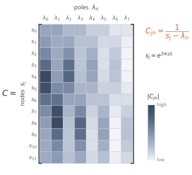

A diagonal-plus-low-rank state matrix still defines the same kind of state space model, but its kernel can be generated through the resolvent rather than by repeated dense multiplication. The calculation moves to frequency nodes, rewrites the discrete resolvent through the continuous-time matrix, uses the diagonal-plus-low-rank form, and returns to the time domain with an inverse FFT.

## 10.1 The computational target {#sec-10-1}

The state space layer still contains the discrete state space model

$$
x_{k+1}=\Abar x_k+\Bbar u_k,
\qquad
y_k=Cx_{k+1}.
$$

Its kernel is

$$
\Kbar_m=C\Abar^m\Bbar,
\qquad
m=0,\dots,L-1.
$$

Forming the kernel directly costs $\bigO(LN^2)$. Each new coefficient $\Kbar_m$ multiplies the previous state vector by the dense $N\times N$ matrix $\Abar$ at $\bigO(N^2)$, and the $L$ multiplications are sequential in $m$, so no coefficient can be formed until its predecessor is. The computational target is to evaluate the resolvent expression $C(I-z\Abar)^{-1}\Bbar$ at the required frequency nodes and recover the kernel in $\bigO(LN+L\log L)$, with the work over the $L$ nodes parallel rather than chained.

The S4 kernel algorithm reaches that target by composing four reductions.[^s4-kernel-reference] The kernel generating function replaces the powers $\Abar^m$ by a discrete resolvent, and the inverse FFT returns the time-domain kernel from samples of that resolvent. The bilinear discretisation rewrites the discrete resolvent through the continuous-time matrix $A$. The diagonal-plus-low-rank (DPLR) form of $A$ makes the continuous resolvent structured. A matrix of reciprocal differences evaluates the diagonal resolvent over all frequency nodes, and the Woodbury identity carries the low-rank part through a small inverse.

## 10.2 From kernel coefficients to Fourier samples {#sec-10-2}

The expensive term in the kernel definition is the sequence of powers $\Abar^m$. Reading the coefficients as those of a polynomial collects the powers into a single inverse. For a finite kernel of length $L$, define

$$
\GL(z)
=
\sum_{m=0}^{L-1}\Kbar_m z^m.
$$

This is the length-$L$ kernel polynomial, the generating function cut off after $L$ terms.

Substituting

$$
\Kbar_m=C\Abar^m\Bbar
$$

gives

$$
\GL(z)
=
C\left(\sum_{m=0}^{L-1}(z\Abar)^m\right)\Bbar.
$$

The finite geometric series identity gives

$$
\sum_{m=0}^{L-1}(z\Abar)^m
=
\left(I-(z\Abar)^L\right)(I-z\Abar)^{-1},
$$

whenever the inverse exists. Therefore

$$
\boxed{
\GL(z)
=
C\left(I-(z\Abar)^L\right)(I-z\Abar)^{-1}\Bbar.
}
$$

The individual powers have been collected into an inverse:

$$
(I-z\Abar)^{-1}.
$$

The inverse is the discrete resolvent.

The infinite generating function is the simpler expression

$$
G(z)
=
\sum_{m=0}^{\infty}\Kbar_mz^m
=
C(I-z\Abar)^{-1}\Bbar,
$$

inside its region of convergence. The finite expression adds the truncation factor

$$
I-(z\Abar)^L.
$$

The factor removes circular aliasing. Sampling the infinite generating function at the $L$ roots of unity folds the tail coefficients $\Kbar_{m+L},\Kbar_{m+2L},\dots$ back onto lag $m$. The factor $I-(z\Abar)^L$ subtracts that folded tail, so the finite generating function recovers the true first $L$ coefficients rather than the aliased ones.

A generating function recovers the coefficients only after it is sampled. For a length-$L$ sequence, the roots of unity give samples whose inverse transform can be computed by an FFT. Let

$$
\omega_j=e^{-2\pi i j/L},
\qquad
j=0,1,\dots,L-1.
$$

The nodes are the $L$th roots of unity. Since

$$
\omega_j^L=1,
$$

the finite generating function becomes

$$
\GL(\omega_j)
=
C\left(I-\Abar^L\right)(I-\omega_j\Abar)^{-1}\Bbar.
$$

The factor $C(I-\Abar^L)$ does not depend on the node $j$. It can be formed once and reused at every node, so the per-node work lies entirely in the resolvent $(I-\omega_j\Abar)^{-1}\Bbar$.

The values

$$
\GL(\omega_0),\dots,\GL(\omega_{L-1})
$$

are the forward discrete Fourier transform of the kernel coefficients. With $\omega_j=e^{-2\pi ij/L}$ already fixed, the sum

$$
\GL(\omega_j)
=
\sum_{m=0}^{L-1}\Kbar_m\omega_j^m
$$

is exactly the standard forward transform, with no remaining sign choice.

Thus the time-domain kernel can be recovered by an inverse FFT:[^fft-kernel-reference]

$$
(\Kbar_0,\dots,\Kbar_{L-1})
=
\ifft
\left(
\GL(\omega_0),\dots,\GL(\omega_{L-1})
\right).
$$

The inverse transform carries the $1/L$ factor, matching `numpy.fft.ifft`.

The inverse FFT costs

$$
\bigO(L\log L).
$$

The dominant cost is the evaluation of

$$
(I-\omega_j\Abar)^{-1}\Bbar
$$

for all Fourier nodes.

## 10.3 The bilinear discretisation {#sec-10-3}

The discrete resolvent still carries $\Abar$, which is itself built from a matrix inverse. Rewriting it in terms of the continuous-time matrix removes one layer of discretisation. S4 uses the bilinear discretisation. For a continuous-time state matrix $A$ and step size $\Delta$, define

$$
\Abar
=
\left(I-\frac{\Delta}{2}A\right)^{-1}
\left(I+\frac{\Delta}{2}A\right),
$$

$$
\Bbar
=
\left(I-\frac{\Delta}{2}A\right)^{-1}\Delta B.
$$

Write

$$
\alpha=\frac{\Delta}{2}.
$$

Then

$$
\Abar=(I-\alpha A)^{-1}(I+\alpha A),
\qquad
\Bbar=(I-\alpha A)^{-1}\Delta B.
$$

The rearrangement is a short substitution. Put $\Abar=(I-\alpha A)^{-1}(I+\alpha A)$ into $I-z\Abar$ and multiply through by $(I-\alpha A)$ on the left to clear the inner inverse,

$$
(I-\alpha A)(I-z\Abar)
=
(I-\alpha A)-z(I+\alpha A)
=
(1-z)I-\alpha(1+z)A
=
\alpha(1+z)\!\left(s(z)I-A\right),
$$

with $s(z)=\frac{1-z}{\alpha(1+z)}=\frac{2}{\Delta}\frac{1-z}{1+z}$ from $\alpha=\Delta/2$. Inverting and multiplying by $\Bbar=(I-\alpha A)^{-1}\Delta B$ cancels the cleared factor and leaves the scalar prefactor $\Delta/(\alpha(1+z))=2/(1+z)$, so

$$
(I-z\Abar)^{-1}\Bbar
=
\frac{2}{1+z}
\left(
\frac{2}{\Delta}\frac{1-z}{1+z}I-A
\right)^{-1}B,
$$

for $z\ne -1$. The prefactor $2/(1+z)$ and the point $s(z)$ both fall out of that single collection of coefficients. At $z=-1$, which is a Fourier node exactly when $L$ is even, the expression has the finite limit $\tfrac{\Delta}{2}B$.

Thus evaluating the discrete resolvent reduces to evaluating the continuous-time resolvent

$$
(sI-A)^{-1}
$$

at the transformed point

$$
\boxed{
s=s(z)
=
\frac{2}{\Delta}\frac{1-z}{1+z}.
}
$$

The bilinear map sends the Fourier nodes in the discrete variable $z$ to points in the continuous resolvent variable $s$. It carries the unit circle to the imaginary axis, so every node $s_j=s(\omega_j)$ is purely imaginary. The eigenvalues of a stable $A$, including the HiPPO modes used here, lie in the open left half-plane. The two sets are therefore disjoint, so the reciprocal differences $s_j-\lambda_n$ used by the Cauchy matrix are nonzero.

## 10.4 The diagonal resolvent as a Cauchy product {#sec-10-4}

The continuous resolvent $(sI-A)^{-1}$ is still an $N\times N$ inverse at every node. Diagonal structure removes the inverse entirely. First suppose the continuous-time state matrix is diagonal:

$$
A=\Lambda
=
\diag(\lambda_0,\dots,\lambda_{N-1}).
$$

Then

$$
(sI-A)^{-1}
=
\diag
\left(
\frac{1}{s-\lambda_0},
\dots,
\frac{1}{s-\lambda_{N-1}}
\right).
$$

For scalar input and output,

$$
C(sI-A)^{-1}B
=
\sum_{n=0}^{N-1}
\frac{C_nB_n}{s-\lambda_n}.
$$

Define

$$
w_n=C_nB_n.
$$

Then the evaluation at a point $s$ is

$$
\sum_{n=0}^{N-1}\frac{w_n}{s-\lambda_n}.
$$

Diagonal structure replaces the $N\times N$ matrix inverse with a sum of scalar reciprocal terms.

The S4 kernel needs the generating function at many nodes, so the same reciprocal sum must be evaluated across the whole Fourier grid at once. Let

$$
s_j=s(\omega_j),
\qquad
j=0,\dots,L-1.
$$

For each $s_j$, the diagonal resolvent gives

$$
\sum_{n=0}^{N-1}\frac{w_n}{s_j-\lambda_n}.
$$

The same denominator pattern appears for every evaluation:

$$
s_j-\lambda_n.
$$

Collect these reciprocals into a matrix

$$
\mathcal C_{jn}
=
\frac{1}{s_j-\lambda_n},
\qquad
0\le j<L,
\quad
0\le n<N.
$$

Then the vector of evaluations is

$$
\begin{pmatrix}
\sum_n \dfrac{w_n}{s_0-\lambda_n}\\[0.7em]
\sum_n \dfrac{w_n}{s_1-\lambda_n}\\
\vdots\\
\sum_n \dfrac{w_n}{s_{L-1}-\lambda_n}
\end{pmatrix}
=
\mathcal Cw.
$$

A matrix with entries of the form

$$
\frac{1}{s_j-\lambda_n}
$$

is a **Cauchy matrix**.[^cauchy-sign-convention] The corresponding multiplication is the Cauchy product.

The Cauchy structure separates the evaluation grid $s_j$ from the state modes $\lambda_n$. Every interaction is a reciprocal difference.[^cauchy-vandermonde-reference]

A direct Cauchy product costs

$$
\bigO(LN).
$$

This is cheaper than $\bigO(LN^2)$ and parallel over both $j$ and $n$. Fast multipole-type algorithms evaluate the same product in $\bigO((L+N)\log^2(L+N))$, although implementations here use the direct $\bigO(LN)$ product.

{fig-alt="A grid of reciprocal differences indexed by nodes and poles." fig-align="center" width="80%"}

## 10.5 The low-rank correction {#sec-10-5}

The diagonal case ignores the low-rank term. The S4 matrix keeps it:

$$
A=\Lambda-PQ^*,
\qquad
P,Q\in\C^{N\times r},
$$

where $r$ is small.

Then

$$
sI-A
=
sI-\Lambda+PQ^*.
$$

Let

$$
D_s=(sI-\Lambda)^{-1}.
$$

The matrix is diagonal.

A low-rank correction should not require an $N\times N$ inverse. The matrix inversion lemma, also called the **Woodbury identity** [@hager1989], gives

$$
\boxed{
(sI-A)^{-1}
=
D_s
-
D_sP
\left(I_r+Q^*D_sP\right)^{-1}
Q^*D_s.
}
$$

The Woodbury identity replaces the $N\times N$ inverse by the diagonal resolvent $D_s$ and a single $r\times r$ inverse

$$
\left(I_r+Q^*D_sP\right)^{-1}.
$$

The correction $PQ^*$ acts only in the $r$-dimensional range of $P$, so that small inverse is the only genuinely new computation. Everything else is the diagonal resolvent already in hand.

For rank one, with

$$
A=\Lambda-pq^*,
$$

this becomes

$$
(sI-A)^{-1}
=
D_s
-
\frac{D_spq^*D_s}{1+q^*D_sp}.
$$

Applying $C$ and $B$ gives

$$
C(sI-A)^{-1}B
=
CD_sB
-
\frac{(CD_sp)(q^*D_sB)}{1+q^*D_sp}.
$$

Each factor is built from sums of the same reciprocal form:

$$
\sum_{n=0}^{N-1}\frac{a_nb_n}{s-\lambda_n}.
$$

In the rank-one case the correction reads as four such sums, $CD_sB$, $CD_sp$, $q^*D_sp$, and $q^*D_sB$. Each is one Cauchy sum over the $N$ modes at $\bigO(N)$, so the correction multiplies the diagonal work by a small constant rather than changing its order. For general rank $r$ the count grows to a fixed number of sums and one $r\times r$ solve, at a per-node cost of $\bigO(Nr^2+r^3)$.

Thus the low-rank correction is handled exactly, while the expensive work remains the Cauchy product.

## 10.6 Assembling the kernel and its cost {#sec-10-6}

The kernel is computed by composing the maps below.

Start with a continuous-time state matrix in diagonal-plus-low-rank form:

$$
A=\Lambda-PQ^*.
$$

Choose a step size $\Delta$ and use the bilinear discretisation:

$$
\Abar
=
\left(I-\frac{\Delta}{2}A\right)^{-1}
\left(I+\frac{\Delta}{2}A\right),
\qquad
\Bbar
=
\left(I-\frac{\Delta}{2}A\right)^{-1}\Delta B.
$$

Evaluate the finite generating function at Fourier nodes:

$$
\GL(\omega_j)
=
C(I-\Abar^L)(I-\omega_j\Abar)^{-1}\Bbar.
$$

The factor $C(I-\Abar^L)$ does not depend on the node $j$. It can be absorbed into an effective output map

$$
\tilde C=C(I-\Abar^L).
$$

This changes the parameterisation: $\tilde C$ is the readout used for the chosen kernel length, not a length-independent original $C$ unless the relation above is inverted. In the kernel-generation algorithm, $\tilde C$ is learned or stored directly, so the length-$L$ power $\Abar^L$ is not formed inside the per-node loop.

Use the bilinear map

$$
s_j
=
\frac{2}{\Delta}
\frac{1-\omega_j}{1+\omega_j}
$$

to express the discrete resolvent through the continuous resolvent:

$$
(s_jI-A)^{-1}.
$$

Use the DPLR form

$$
A=\Lambda-PQ^*
$$

and Woodbury to reduce this resolvent to diagonal resolvents and small $r\times r$ inverses.

Evaluate the diagonal resolvent terms at all nodes through Cauchy products.

Finally, apply an inverse FFT to recover

$$
\Kbar_0,\dots,\Kbar_{L-1}.
$$

The recurrence and the convolution still describe the same state space model. S4 changes the way the kernel is produced.

Each stage of the pipeline carries a cost. The dense kernel construction costs

$$
\bigO(LN^2)
$$

because each new kernel coefficient requires a dense matrix-vector multiplication.

In diagonal form, evaluation of the generating function at $L$ nodes is a Cauchy product. A direct implementation costs

$$
\bigO(LN),
$$

with no sequential dependence over the lags.

With a rank-$r$ low-rank correction, Woodbury introduces a fixed number of additional Cauchy sums and small $r\times r$ matrix inverses. For small $r$, the dominant structured computation remains the Cauchy product.

After the kernel is generated, applying it to a length-$L$ sequence by FFT convolution costs

$$
\bigO(L\log L).
$$

Assembling these stages, for fixed rank $r$ the kernel is generated in $\bigO(LN+L\log L)$: $\bigO(LN)$ for the Cauchy products over the grid and $\bigO(L\log L)$ for the inverse FFT. Applying the kernel costs a further $\bigO(L\log L)$. Repeated dense state multiplication is replaced by structured operations over a grid of frequency nodes.

The dense definition and the structured pipeline produce the same kernel. For a
small DPLR system $A=\Lambda-PQ^*$, forming its length-$L$ kernel by the dense
definition $\Kbar_m=C\Abar^m\Bbar$ and by the structured pipeline of S4
[@gu2022s4] gives the same coefficients up to floating-point error. The NumPy,
PyTorch, and JAX implementations all reproduce the comparison.

```{python}
# shared example: a small DPLR system A = diag(Lambda) - P Q*
import numpy as np

N = 4
Lambda = np.array([-0.5 + 1.0j, -0.5 - 1.0j, -0.8 + 2.0j, -0.8 - 2.0j])
P = np.array([1.0, 0.5, -0.5, 0.5]).reshape(N, 1)
Q = np.array([0.5, -1.0, 1.0, 0.5]).reshape(N, 1)
B = np.array([1.0, 0.5, -0.5, 1.0])
C = np.array([1.0, -1.0, 0.5, 0.5])
dt, L = 0.1, 16
```

Each library forms the length-$L$ kernel by the dense definition and by the structured pipeline, and reports the largest coefficient-wise difference:

::: {.panel-tabset}

## NumPy

```{python}
from ssm_book.numpy_ref.s4_reference import dense_kernel, structured_kernel

K_dense = dense_kernel(Lambda, P, Q, B, C, dt, L)
K_struct = structured_kernel(Lambda, P, Q, B, C, dt, L)
err = float(np.max(np.abs(K_dense - K_struct)))
print(f"max |dense kernel - structured kernel| = {err:.1e}")
```

## PyTorch

```{python}
import torch
from ssm_book.torch_ref.s4 import (
    dense_kernel as dense_t, structured_kernel as struct_t)

K_dense = dense_t(Lambda, P, Q, B, C, dt, L)
K_struct = struct_t(Lambda, P, Q, B, C, dt, L)
err = float(torch.max(torch.abs(K_dense - K_struct)))
print(f"max |dense kernel - structured kernel| = {err:.1e}")
```

## JAX

```{python}
import jax.numpy as jnp
from ssm_book.jax_ref.s4 import (
    dense_kernel as dense_j, structured_kernel as struct_j)

K_dense = dense_j(Lambda, P, Q, B, C, dt, L)
K_struct = struct_j(Lambda, P, Q, B, C, dt, L)
err = float(jnp.max(jnp.abs(K_dense - K_struct)))
print(f"max |dense kernel - structured kernel| = {err:.1e}")
```

:::

The whole construction is a chain of reductions, each removing one obstruction the one before it exposed:

$$
\begin{array}{rcl}
\text{meaningful memory} & \leadsto & \text{HiPPO state matrix},\\[0.25em]
\text{dense matrix} & \leadsto & \text{normal plus low-rank form},\\[0.25em]
\text{normal part} & \leadsto & \text{diagonal coordinates},\\[0.25em]
\text{kernel powers} & \leadsto & \text{resolvent evaluations},\\[0.25em]
\text{diagonal resolvents} & \leadsto & \text{Cauchy products},\\[0.25em]
\text{frequency samples} & \leadsto & \text{time-domain kernel by inverse FFT}.
\end{array}
$$

The first row gives the state a memory interpretation. The second rewrites the dense matrix as a normal matrix plus a low-rank term. The remaining rows are computational: the diagonal coordinates [obtained in the previous chapter](08-structured-state-matrices.qmd#sec-9-3), resolvent evaluations of the generating function, Cauchy products over the frequency grid, and the inverse FFT back to the time domain. The S4 kernel algorithm is the composition of these reductions.

The low-rank correction is the most intricate stage. It is handled exactly, but it carries the Woodbury terms, the extra Cauchy sums, and the $r\times r$ solves that the diagonal part avoids. A purely diagonal state matrix removes that machinery and keeps only the modal part of the construction.

## 10.7 Notation {#sec-10-7}

| Symbol | Meaning | Type |
|---|---|---|
| $\GL(z)$ | finite kernel generating function | scalar function |
| $\omega_j$ | Fourier node $e^{-2\pi ij/L}$ | complex scalar |
| $s(z)$ | bilinear image of the node $z$ | complex scalar |
| $\Lambda$ | diagonal continuous state matrix | $\C^{N\times N}$ |
| $P,Q$ | low-rank factors | $\C^{N\times r}$ |
| $D_s$ | diagonal resolvent $(sI-\Lambda)^{-1}$ | $\C^{N\times N}$ |
| $\mathcal C$ | Cauchy matrix with entries $1/(s_j-\lambda_n)$ | $\C^{L\times N}$ |
| $r$ | rank of the low-rank correction | positive integer |


[^s4-kernel-reference]: The structured kernel construction is the S4 construction [@gu2022s4], which rewrites the dense state matrix in diagonal-plus-low-rank form so that the length-$L$ kernel can be generated without repeated dense multiplication.

[^fft-kernel-reference]: Moving between the frequency samples $\GL(\omega_j)$ and the time-domain coefficients $\Kbar_m$ uses the fast Fourier transform [@cooley1965fft].

[^cauchy-sign-convention]: Cauchy matrices are also written with entries such as $1/(x_j-y_n)$, $1/(y_n-x_j)$, or $1/(x_j+y_n)$. These conventions differ by signs or by how the nodes are named; the useful structure is the reciprocal interaction between one evaluation node and one state mode.

[^cauchy-vandermonde-reference]: Evaluating many rational terms $1/(s_j-\lambda_n)$ at once is the Cauchy, or Cauchy-and-Vandermonde, structure of numerical linear algebra [@pan2001].


## Summary {.unnumbered}

The S4 kernel algorithm generates the length-$L$ kernel without repeated dense multiplication by $\bar A$. The finite kernel polynomial is sampled at roots of unity, corrected for the truncation factor, and recovered by an inverse FFT.

The bilinear map converts the discrete resolvent into a continuous-time resolvent. In DPLR coordinates, the diagonal part becomes a Cauchy product over frequency nodes and eigenvalues, while the low-rank correction is handled by Woodbury. For fixed rank, kernel generation costs $\bigO(LN+L\log L)$, followed by $\bigO(L\log L)$ to apply the convolution.

The effective readout $\tilde C=C(I-\bar A^L)$ is length-dependent when used this way. The algorithm learns or stores that effective readout directly rather than forming the dense power inside the per-node computation.

## Exercises {.unnumbered}

1. Write a function that takes $(\Abar,\Bbar,C)$ and a length $L$ and returns the
   kernel $\Kbar_0,\dots,\Kbar_{L-1}$ by the dense definition $\Kbar_m=C\Abar^m\Bbar$.
   Generate the coefficients by the recurrence $v_0=\Bbar$, $v_{m+1}=\Abar v_m$, and
   $\Kbar_m=Cv_m$, rather than forming each power $\Abar^m$ separately. State the cost
   in terms of $L$ and $N$ for dense $\Abar$ and for diagonal $\Abar$.

   ::: {.callout-tip collapse="true"}
   ## Solution

   Carry one state vector and read off a coefficient at each step, so that no power $\Abar^m$ is formed explicitly. The reference `dense_kernel` is exactly this recurrence.

   ```python
   import numpy as np

   def kernel_dense(Abar, Bbar, C, L):
       Abar = np.asarray(Abar, dtype=complex)
       Bbar = np.asarray(Bbar, dtype=complex).reshape(-1)
       C = np.asarray(C, dtype=complex).reshape(-1)
       K = np.empty(L, dtype=complex)
       v = Bbar.copy()              # v_0 = Bbar
       for m in range(L):
           K[m] = C @ v             # Kbar_m = C v_m
           v = Abar @ v             # v_{m+1} = Abar v_m
       return K
   ```

   Each step performs one matrix-vector product $\Abar v_m$ and one inner product $Cv_m$. For dense $\Abar$ the matrix-vector product costs $\bigO(N^2)$, so $L$ steps cost $\bigO(LN^2)$. For diagonal $\Abar$ the product is a coordinate-wise scaling costing $\bigO(N)$, so the whole kernel costs $\bigO(LN)$. The diagonal saving is one factor of $N$, and it comes entirely from the matrix-vector product no longer mixing coordinates.
   :::

2. Let $\Lambda=\diag(\lambda_0,\dots,\lambda_{N-1})$ and let $w_n=C_nB_n$. Show that
   $C(sI-\Lambda)^{-1}B=\sum_{n}w_n/(s-\lambda_n)$, and write a function that evaluates
   this sum at a single node $s$. Extend it to a whole Fourier grid $s_0,\dots,s_{L-1}$
   by forming the Cauchy matrix $\mathcal C_{jn}=1/(s_j-\lambda_n)$ and computing
   $\mathcal Cw$. Count the operations and compare them with the dense kernel of
   Exercise 1.

   ::: {.callout-tip collapse="true"}
   ## Solution

   With $\Lambda$ diagonal, $(sI-\Lambda)^{-1}=\diag\!\big(1/(s-\lambda_0),\dots,1/(s-\lambda_{N-1})\big)$. Sandwiching this between the row $C$ and the column $B$ keeps only the diagonal:

   $$
   C(sI-\Lambda)^{-1}B
   =\sum_{n=0}^{N-1}\frac{C_nB_n}{s-\lambda_n}
   =\sum_{n=0}^{N-1}\frac{w_n}{s-\lambda_n}.
   $$

   The single-node sum is `cauchy_dot(w, s, Lambda)`. For a whole grid, form the Cauchy matrix $\mathcal C_{jn}=1/(s_j-\lambda_n)$ and multiply by $w$.

   ```python
   import numpy as np

   def diag_resolvent_node(w, s, Lambda):
       w = np.asarray(w, dtype=complex).reshape(-1)
       Lambda = np.asarray(Lambda, dtype=complex).reshape(-1)
       return np.sum(w / (s - Lambda))         # sum_n w_n/(s - lambda_n)

   def diag_resolvent_grid(w, s_grid, Lambda):
       w = np.asarray(w, dtype=complex).reshape(-1)
       s_grid = np.asarray(s_grid, dtype=complex).reshape(-1)
       Lambda = np.asarray(Lambda, dtype=complex).reshape(-1)
       C = 1.0 / (s_grid[:, None] - Lambda[None, :])   # Cauchy matrix, L x N
       return C @ w                                    # one value per node
   ```

   A single node costs $\bigO(N)$. Forming $\mathcal C$ and multiplying it by $w$ over $L$ nodes costs $\bigO(LN)$, the same total as the diagonal recurrence of Exercise 1 and a factor of $N$ below the dense $\bigO(LN^2)$. The difference is that the dense recurrence is sequential in $m$, whereas the Cauchy product has no dependence across nodes or modes and the entries $1/(s_j-\lambda_n)$ can all be formed at once.
   :::

3. Starting from the diagonal resolvent of Exercise 2, add the rank-one correction for
   $A=\Lambda-pq^*$. Using
   $(sI-A)^{-1}=D_s-\dfrac{D_spq^*D_s}{1+q^*D_sp}$ with $D_s=(sI-\Lambda)^{-1}$,
   write $C(sI-A)^{-1}B$ as a combination of four reciprocal sums of the form
   $\sum_n a_nb_n/(s-\lambda_n)$. Identify the four pairs $(a,b)$. Then generalise to
   rank $r$ using the $r\times r$ Woodbury inverse $(I_r+Q^*D_sP)^{-1}$.

   ::: {.callout-tip collapse="true"}
   ## Solution

   Multiply the rank-one resolvent on the left by $C$ and on the right by $B$:

   $$
   C(sI-A)^{-1}B
   =CD_sB
   -\frac{(CD_sp)(q^*D_sB)}{1+q^*D_sp}.
   $$

   Each factor is a quadratic form $a^\top D_s b=\sum_n a_nb_n/(s-\lambda_n)$, because $D_s$ is diagonal. Reading off the four pairs:

   $$
   CD_sB:\ (C,B),
   \qquad
   CD_sp:\ (C,p),
   \qquad
   q^*D_sB:\ (\bar q,B),
   \qquad
   q^*D_sp:\ (\bar q,p),
   $$

   where $\bar q$ is the entrywise conjugate, so that $q^*D_sB=\sum_n \bar q_nB_n/(s-\lambda_n)$. The four sums are each `cauchy_dot` calls.

   ```python
   import numpy as np
   from ssm_book.numpy_ref.s4_reference import cauchy_dot

   def rank_one_resolvent(s, Lambda, p, q, B, C):
       p, q = np.asarray(p, complex).reshape(-1), np.asarray(q, complex).reshape(-1)
       B, C = np.asarray(B, complex).reshape(-1), np.asarray(C, complex).reshape(-1)
       CDsB = cauchy_dot(C * B, s, Lambda)          # (C, B)
       CDsp = cauchy_dot(C * p, s, Lambda)          # (C, p)
       qDsB = cauchy_dot(q.conj() * B, s, Lambda)   # (conj q, B)
       qDsp = cauchy_dot(q.conj() * p, s, Lambda)   # (conj q, p)
       return CDsB - (CDsp * qDsB) / (1.0 + qDsp)
   ```

   For rank $r$, $P,Q\in\C^{N\times r}$ and the scalar $1+q^*D_sp$ becomes the $r\times r$ matrix $I_r+Q^*D_sP$. The Woodbury identity gives

   $$
   (sI-A)^{-1}=D_s-D_sP\,(I_r+Q^*D_sP)^{-1}Q^*D_s,
   $$

   so $C(sI-A)^{-1}B=CD_sB-(CD_sP)(I_r+Q^*D_sP)^{-1}(Q^*D_sB)$. Every entry of $CD_sP$, $Q^*D_sP$, and $Q^*D_sB$ is again a sum $\sum_n a_nb_n/(s-\lambda_n)$ over a column of $P$ or $Q$, and the only dense inverse is the $r\times r$ one. The reference function `woodbury_resolvent_vector` computes this vector; applying $C$ to its output reproduces the dense $C(sI-A)^{-1}B$ to floating-point error.
   :::

4. For a small DPLR system $A=\Lambda-PQ^*$ with $N=4$ and $r=1$, compute the kernel
   both by the dense definition and by the structured pipeline (bilinear map, Woodbury
   resolvent, inverse FFT). Report the largest coefficient-wise difference. Repeat with
   $L$ even and $L$ odd, and check that the singular node $\omega_j=-1$, present only
   when $L$ is even, is handled correctly.

   ::: {.callout-tip collapse="true"}
   ## Solution

   Build a DPLR system, then compare `dense_kernel` against `structured_kernel` for an even and an odd length.

   ```python
   import numpy as np
   from ssm_book.numpy_ref.s4_reference import dense_kernel, structured_kernel

   N = 4
   Lambda = np.array([-0.5 + 1.0j, -0.5 - 1.0j, -0.8 + 2.0j, -0.8 - 2.0j])
   P = np.array([1.0, 0.5, -0.5, 0.5]).reshape(N, 1)
   Q = np.array([0.5, -1.0, 1.0, 0.5]).reshape(N, 1)
   B = np.array([1.0, 0.5, -0.5, 1.0])
   C = np.array([1.0, -1.0, 0.5, 0.5])
   dt = 0.1

   for L in (16, 15):
       Kd = dense_kernel(Lambda, P, Q, B, C, dt, L)
       Ks = structured_kernel(Lambda, P, Q, B, C, dt, L)
       print(L, float(np.max(np.abs(Kd - Ks))))
   ```

   The largest coefficient-wise difference is about $1.1\times10^{-16}$ for $L=16$ and $7.7\times10^{-17}$ for $L=15$: both at floating-point level. The two routes agree because the samples $\GL(\omega_j)=\sum_m\Kbar_m\omega_j^m$ are exactly the forward transform of the kernel, so the inverse FFT inverts them precisely.

   The roots of unity include $\omega_j=-1$ exactly when $L$ is even; for $L=16$ this is the node $j=L/2=8$, and for $L=15$ no node equals $-1$. At $z=-1$ the bilinear map $s(z)=\tfrac{2}{\Delta}\tfrac{1-z}{1+z}$ diverges, so the per-node evaluation cannot use the resolvent directly. The reference `generating_function` detects $|1+z|<10^{-12}$ and substitutes the finite limit $\tfrac{2}{1+z}(s(z)I-A)^{-1}B\to\tfrac{\Delta}{2}B$. With that substitution the even case matches the dense kernel to the same precision as the odd case, which confirms the singular node is handled correctly rather than skipped.
   :::

5. Read the pipeline as a sequence of reductions: kernel powers to a resolvent,
   dense resolvent to a diagonal resolvent, diagonal resolvent to a Cauchy product,
   low-rank correction by Woodbury, and frequency samples to the time-domain kernel
   by inverse FFT. For each step, state the expensive computation it removes and the cost it
   replaces. Which single reduction is responsible for moving the kernel cost from
   $\bigO(LN^2)$ to $\bigO(LN)$?

   ::: {.callout-tip collapse="true"}
   ## Solution

   Taking the steps in order:

   - Kernel powers to a resolvent. Direct computation forms the sequence $\Abar^0,\dots,\Abar^{L-1}$ by $L$ sequential dense multiplications at $\bigO(LN^2)$. Reading the coefficients as a generating function collects the powers into a single inverse $(I-z\Abar)^{-1}$, sampled at the $L$ roots of unity.
   - Dense resolvent to a diagonal resolvent. Direct evaluation of $(sI-A)^{-1}$ requires an $N\times N$ inverse at every node. Diagonalising the normal part makes the resolvent $\diag\big(1/(s-\lambda_n)\big)$, replacing each $\bigO(N^3)$ inverse with $N$ scalar reciprocals.
   - Diagonal resolvent to a Cauchy product. The avoidable computation is repeating the reciprocal sum $\sum_n w_n/(s-\lambda_n)$ separately at every node. Collecting the denominators into the Cauchy matrix $\mathcal C_{jn}=1/(s_j-\lambda_n)$ turns the whole grid into one product $\mathcal Cw$ at $\bigO(LN)$, with no dependence across nodes.
   - Low-rank correction by Woodbury. The true matrix is $\Lambda-PQ^*$, not diagonal, so the diagonal resolvent is not exact. The Woodbury identity replaces the $N\times N$ inverse with the diagonal $D_s$ and a small $r\times r$ inverse, leaving the dominant work as Cauchy evaluation.
   - Frequency samples to the time-domain kernel. The structured computation produces $\GL(\omega_j)$, not the coefficients $\Kbar_m$. The inverse FFT inverts the transform at $\bigO(L\log L)$.

   The single reduction responsible for the $\bigO(LN^2)\to\bigO(LN)$ change is the diagonalisation of the resolvent. Once $(sI-A)^{-1}$ is diagonal, each node costs $\bigO(N)$ rather than $\bigO(N^2)$; the Cauchy product is the organised form of that gain across the grid, and Woodbury preserves it under the low-rank correction, but neither lowers the order further.
   :::
