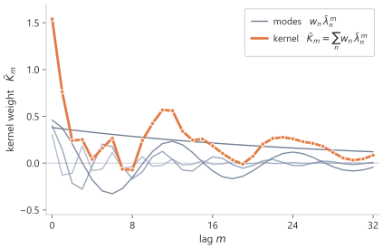

The diagonal models ask how much of S4 remains after the low-rank correction is removed. With a diagonal state matrix, each coordinate contributes one damped oscillatory mode, and the kernel is a learned mixture of those modes. The low-rank algebra disappears; the main design problem becomes the placement and parameterisation of the eigenvalues.

## 11.1 Removing the correction {#sec-11-1}

The full S4 construction keeps a low-rank correction because the HiPPO matrix requires it. After diagonalising the normal part, the state matrix has the form
$$
A=\Lambda-PQ^*.
$$

That correction is not free. Generating the length-$L$ kernel from the diagonal-plus-low-rank form runs the resolvent through a kernel generating function, a Cauchy evaluation of many rational terms, a Woodbury correction for the rank-one term, and an inverse fast Fourier transform back to the time domain. Each stage carries its own constants and its own numerical care. The low-rank correction is useful only if its exact reconstruction of the HiPPO matrix matters more than the cost and complexity it adds. A diagonal model tests the alternative: keep the eigenvalue placement and remove the correction.

A model that keeps only a complex diagonal state matrix, with no normal part and no low-rank term, and computes the length-$L$ kernel from its eigenvalues, is called a **Diagonal State Space** (**DSS**) model [@gupta2022dss]. When its diagonal entries were initialised from the eigenvalues of the HiPPO-derived matrix, the diagonal model matched the full S4 construction on long-range tasks. The low-rank correction, which reproduces the HiPPO matrix exactly, is not needed for performance once the eigenvalues are placed well.

That finding suggests a simpler state matrix:
$$
A=\Lambda.
$$

The result is a **diagonal state space model**.

The diagonal model is not a different kind of state equation. It is still
$$
x'(t)=Ax(t)+Bu(t),
\qquad
y(t)=Cx(t).
$$

The simplification is entirely in the structure of $A$.

The diagonal S4 family is called **S4D**.[^diagonal-lineage] The letter "D" refers to the diagonal state matrix. Where DSS shows that a purely diagonal model can work, S4D explains which part of the structured construction it keeps. It traces the working diagonal back to the normal part of the HiPPO matrix and studies how to parameterise and initialise it.

## 11.2 The continuous-time diagonal kernel {#sec-11-2}

A diagonal $A$ gives an impulse response in closed form. Let
$$
A=\diag(\lambda_0,\dots,\lambda_{N-1}),
\qquad
B\in\C^N,
\qquad
C\in\C^{1\times N}.
$$

The continuous-time impulse response is
$$
h(t)=Ce^{At}B.
$$

Since $A$ is diagonal,
$$
e^{At}
=
\diag(e^{\lambda_0t},\dots,e^{\lambda_{N-1}t}).
$$

Therefore
$$
\boxed{
h(t)
=
\sum_{n=0}^{N-1}C_nB_ne^{\lambda_nt}.
}
$$

A diagonal state space model is a learned sum of exponential modes. If
$$
\lambda_n=-\alpha_n+i\omega_n,
$$

then
$$
e^{\lambda_nt}
=
e^{-\alpha_nt}
\left(
\cos(\omega_nt)+i\sin(\omega_nt)
\right).
$$

The real part $-\alpha_n$ sets the decay rate. The imaginary part $\omega_n$ sets the oscillation frequency.

Each mode is therefore a damped complex sinusoid with timescale $1/\alpha_n$ and oscillation period $2\pi/\omega_n$.[^complex-real-kernel] The boxed kernel sums these modes, so the diagonal state space model is a bank of fading memories held at chosen timescales, matching the fading-memory weights of [Section 3.4](../02-foundations/02-continuous-time.qmd#sec-3-4). Take $\alpha=0.5$ and $\omega=\pi$ as one worked mode. Its envelope $e^{-0.5t}$ has half-life $\log 2/0.5\approx 1.4$ time units, and its oscillation completes one period every $2\pi/\pi=2$ time units, so this mode fades by half over a little more than one oscillation.

{fig-alt="Faint individual decaying modes and their bold sum versus lag." fig-align="center" width="80%"}

## 11.3 The discrete-time kernel and its Vandermonde form {#sec-11-3}

The sequence model runs on samples, so the continuous modes are discretised before the discrete kernel is read off. Each continuous eigenvalue $\lambda_n$ becomes a discrete eigenvalue $\bar\lambda_n$, the per-mode form of the discrete eigenvalue $\mu$. Under zero-order hold,
$$
\bar\lambda_n=e^{\Delta\lambda_n},
$$

and
$$
\bar B_n=
\frac{e^{\Delta\lambda_n}-1}{\lambda_n}B_n,
$$

with limiting value $\Delta B_n$ when $\lambda_n=0$, since $(e^{\Delta\lambda}-1)/\lambda\to\Delta$ as $\lambda\to0$.

The discrete kernel is
$$
\Kbar_m
=
C\Abar^m\Bbar
=
\sum_{n=0}^{N-1}C_n\bar B_n\bar\lambda_n^m.
$$

Under bilinear discretisation,
$$
\bar\lambda_n
=
\frac{1+\frac{\Delta}{2}\lambda_n}
     {1-\frac{\Delta}{2}\lambda_n},
$$

and
$$
\bar B_n
=
\frac{\Delta}
     {1-\frac{\Delta}{2}\lambda_n}B_n.
$$

In either case, the kernel has the form
$$
\boxed{
\Kbar_m
=
\sum_{n=0}^{N-1}w_n\bar\lambda_n^m
}
$$

for suitable weights $w_n$.

Thus each state coordinate contributes one geometric sequence in discrete time. For a length-$L$ kernel, collect these sequences into the matrix
$$
V_{nm}=\bar\lambda_n^m,
\qquad
0\le n<N,
\quad
0\le m<L.
$$

The matrix $V$ is a **Vandermonde matrix** because each row is generated by repeated powers of one scalar.[^vandermonde-reference]

The diagonal kernel can be written as
$$
\Kbar_m
=
\sum_{n=0}^{N-1}w_nV_{nm}.
$$

Equivalently,
$$
(\Kbar_0,\dots,\Kbar_{L-1})
=
w^\top V.
$$

Forming the kernel from $w^\top V$ costs $O(NL)$ operations. The Cauchy evaluation, Woodbury correction, and generating-function inversion are no longer needed, because there is no low-rank term and no coupling between state coordinates inside the state space model. Kernel generation becomes a structured multiplication by powers of the diagonal eigenvalues.

The recurrence and the Vandermonde kernel are the same map computed in two orders, so they agree on any input. Take four diagonal modes with linearly spaced frequencies, using the S4D-Lin initialisation of @sec-11-6 discretised under zero-order hold to $\bar\lambda_n=e^{\Delta\lambda_n}$. The diagonal recurrence then matches the convolution with the kernel $\bar K_m=\sum_n w_n\bar\lambda_n^m$, where $w_n=C_n\bar B_n$.

```{python}
# shared example: four S4D-Lin modes, discretised at dt = 0.1
import numpy as np
from ssm_book.numpy_ref.diagonal import s4d_lin_init

lam = np.exp(0.1 * s4d_lin_init(4))   # discrete eigenvalues, dt = 0.1
Bbar = np.array([1.0, 0.8, 0.6, 0.4])
C = np.array([0.5, -0.3, 0.2, 0.7])
w = C * Bbar                          # diagonal kernel weights
u = np.cos(np.arange(24) * 0.3)
```

Each library runs the diagonal recurrence and convolves the input with the kernel, then reports the largest difference:

::: {.panel-tabset}

## NumPy

```{python}
from ssm_book.numpy_ref.diagonal import diagonal_kernel, diagonal_recurrence
from ssm_book.numpy_ref.kernels import causal_conv

y_rec = diagonal_recurrence(lam, Bbar, C, u)
y_conv = causal_conv(diagonal_kernel(lam, w, len(u)), u)
err = float(np.max(np.abs(y_rec - y_conv)))
print(f"max |recurrence - convolution| = {err:.1e}")
```

## PyTorch

```{python}
import torch
from ssm_book.torch_ref.diagonal import (
    diagonal_kernel as ker_t, diagonal_recurrence as rec_t)
from ssm_book.torch_ref.kernels import causal_conv as conv_t

y_rec = rec_t(lam, Bbar, C, u)
y_conv = conv_t(ker_t(lam, w, len(u)), u)
err = float(torch.max(torch.abs(y_rec - y_conv)))
print(f"max |recurrence - convolution| = {err:.1e}")
```

## JAX

```{python}
import jax.numpy as jnp
from ssm_book.jax_ref.diagonal import (
    diagonal_kernel as ker_j, diagonal_recurrence as rec_j)
from ssm_book.jax_ref.kernels import causal_conv as conv_j

y_rec = rec_j(lam, Bbar, C, u)
y_conv = conv_j(ker_j(lam, w, len(u)), u)
err = float(jnp.max(jnp.abs(y_rec - y_conv)))
print(f"max |recurrence - convolution| = {err:.1e}")
```

:::

## 11.4 Complex modes and real kernels {#sec-11-4}

If all eigenvalues are real and negative, the kernel is a sum of decaying exponentials. Such a model has fading memory, but no oscillatory memory.

Complex eigenvalues add oscillation. For a real-valued input-output map, complex modes are used in conjugate pairs. If $\lambda$ is included, then $\overline{\lambda}$ is included with conjugate parameters, so that their combined contribution is real.

The algebra makes this explicit. Pairing the mode $w\bar\lambda^m$ with its conjugate gives
$$
w\bar\lambda^m+\overline{w}\,\overline{\bar\lambda}^{\,m}
=
2\Real(w\bar\lambda^m)
=
2|w|\,e^{-\Delta\alpha m}\cos(\Delta\omega m+\phi),
$$

where $\phi$ is the phase of $w$. The pair contributes a single decaying cosine. The real part fixes the envelope $e^{-\Delta\alpha m}$ and the imaginary part supplies the period through $\cos(\Delta\omega m+\phi)$, so a conjugate pair is the discrete-time image of the damped sinusoid of @sec-11-2.

Equivalently, one may store only modes in one half of the complex plane and take the real part of the final sum:
$$
\Kbar_m
=
2\Real
\left(
\sum_n w_n\bar\lambda_n^m
\right),
$$

under the corresponding conjugate-pair convention. The half-plane convention costs no parameters. A model with $N$ real modes stores $N$ real eigenvalues, and a model with $N/2$ conjugate pairs stores $N/2$ pairs $(\alpha,\omega)$, the same count of real numbers, so the choice between them trades real decay for genuine oscillation at no extra storage. The same real-versus-complex issue appears for continuous-time state matrices, where complex coordinates give a compact representation of real oscillatory behaviour.

## 11.5 Why diagonalisation alone is not enough {#sec-11-5}

Many matrices are diagonalisable over $\C$, but a randomly initialised diagonal state space model is not automatically as useful as a structured dense one.

There are two difficulties.

First, the diagonalising change of basis for a general matrix may be poorly conditioned. Algebraically, one may write
$$
A=V\Lambda V^{-1},
$$

but if $V$ is ill-conditioned, the diagonal representation can be numerically unstable. The HiPPO-LegS matrix is the worked instance. It is diagonalisable in exact arithmetic, but its eigenvector matrix is catastrophically ill-conditioned. S4 therefore works in normal-plus-low-rank coordinates rather than diagonalising the HiPPO matrix directly.

Second, a diagonal model trained from an arbitrary initialisation may not discover useful timescales and frequencies. The eigenvalues determine the dictionary of basis kernels:
$$
1,\bar\lambda_n,\bar\lambda_n^2,\dots.
$$

If the eigenvalues are poorly placed, the dictionary may not cover the memory scales needed by the task. Eigenvalues with strongly negative real parts give $|\bar\lambda_n|=e^{\Delta\Real(\lambda_n)}$ near zero, so each $\bar\lambda_n^m$ collapses within a few steps and the kernel becomes short range. No placement of the weights $w_n$ can rebuild long-range memory from modes that have already decayed.

S4D therefore treats the diagonal restriction and the initialisation as one construction: the model is simple only after the eigenvalues have been placed carefully.

## 11.6 Structured diagonal initialisations {#sec-11-6}

Since the initialisation carries the memory, the eigenvalues must be chosen, not drawn at random. The most direct diagonal version starts from the DPLR form associated with the HiPPO matrix:
$$
A=\Lambda-PQ^*.
$$

**S4D-LegS** drops the low-rank correction and keeps
$$
A_D=\Lambda.
$$

The model is diagonal, but the diagonal entries are not arbitrary. They come from the normal part of the HiPPO-derived matrix. S4D-LegS is therefore a simplification of S4 that keeps the HiPPO-derived eigenvalue placement, and with it the memory construction, while dropping the low-rank correction.

S4D also uses simpler explicit initialisations that choose diagonal eigenvalues directly, without first forming the full HiPPO matrix. Let $M$ be the number of complex modes under the half-plane convention.

One linearly spaced initialisation is
$$
\boxed{
\lambda_n
=
-\frac{1}{2}+i\pi n,
\qquad
n=0,1,\dots,M-1.
}
$$

The real part is fixed at $-\frac12$, giving uniform damping. The imaginary parts are linearly spaced, giving Fourier-like frequencies. The initialisation is commonly called **S4D-Lin** [@gu2022s4d].

An inverse-spaced initialisation is
$$
\boxed{
\lambda_n
=
-\frac{1}{2}
+
i\frac{M}{\pi}
\left(
\frac{M}{2n+1}-1
\right),
\qquad
n=0,1,\dots,M-1.
}
$$

The imaginary parts follow an inverse law inspired by the asymptotic spectrum of the HiPPO-derived construction. The initialisation is commonly called **S4D-Inv** [@gu2022s4d].

The constants depend on the normalisation of the time interval, step size, and complex-state convention. What distinguishes the schemes is the distribution of frequencies. S4D-Lin spaces them linearly, while S4D-Inv concentrates them according to an inverse law. The original S4D work [@gu2022s4d] also studies a quadratic law, S4D-Quad, and a milder inverse law, S4D-Inv2, which sit at the two extremes of how the frequencies crowd together.

Both closed forms are structured initialisations. Neither is a random diagonal matrix.

![Figure 11.2. The S4D family of initialisations. Every scheme fixes the decay rate at $\operatorname{Re}\lambda=-\tfrac12$ and differs only in the mode frequencies (the imaginary parts). The horizontal axis sorts the eigenvalues from the highest frequency to the lowest, so each curve traces how that scheme spaces its frequencies. S4D-Inv and the true HiPPO-LegS spectrum crowd the frequencies near zero, so their frequency curves drop fastest. S4D-Quad crowds them at the high end, so its curve drops slowest. S4D-Inv2 is a milder inverse law in between. S4D-Lin spaces frequencies uniformly. The exact top frequency depends on the normalisation and the number of modes. S4D-Lin and S4D-Inv have the closed forms given by the equations. The other curves come from the broader family in the original S4D work.](../../figures/fig-11-2-s4d-init.svg){fig-alt="Line plot of imaginary part (mode frequency) against eigenvalue index, sorted from highest to lowest, for five S4D initialisations. S4D-Quad places more frequencies at the high end. S4D-Inv and S4D-LegS crowd frequencies near zero. S4D-Inv2 sits between them. S4D-Lin spaces frequencies uniformly." fig-align="center" width="86%"}

## 11.7 Stable parameterisation {#sec-11-7}

For continuous-time stability, the real parts of the eigenvalues should be negative, $\Real(\lambda_n)<0$. Stability cannot simply be hoped for during training. A gradient step can push $\Real(\lambda_n)$ across zero, and once it is positive the discrete eigenvalue has $|\bar\lambda_n|=e^{\Delta\Real(\lambda_n)}>1$. Kernel entries then grow as $|\bar\lambda_n|^m$, and the output diverges as the sequence length $L$ increases. The fix is to make the real part negative by construction rather than to constrain it after each step.

A common parameterisation does this with the exponential. Write
$$
\lambda_n=-\exp(a_n)+i\omega_n,
$$

with trainable real $a_n$ and $\omega_n$. Since $\exp(a_n)>0$ for every value of $a_n$, the real part $\Real(\lambda_n)=-\exp(a_n)<0$ holds throughout training, so the model can never leave the stable region.

The step size is parameterised the same way, in log space,
$$
\Delta=\exp(\theta),
$$

with trainable real $\theta$. A gradient step in $\theta$ rescales $\Delta$ multiplicatively rather than additively, which matches the geometric range of useful timescales, where the relevant comparison between two windows is their ratio. Changing $\Delta$ changes the discrete memory length. The continuous eigenvalue $\lambda_n$ determines a physical timescale, while $\Delta$ determines how that timescale is sampled by the sequence.

Under zero-order hold,
$$
\bar\lambda_n=e^{\Delta\lambda_n}.
$$

Thus increasing $\Delta$ moves the discrete eigenvalue farther along its continuous trajectory. Decreasing $\Delta$ makes the discrete update closer to the identity.

## 11.8 Shared state and the parallel scan {#sec-11-8}

A coordinate-wise diagonal layer runs one scalar state space model on each coordinate of the representation. With $H$ such coordinates, often $H=\dmodel$, this is $H$ independent scalar filters. Nothing mixes information across input coordinates inside the state space layer, and the parameter count grows with $H$ separate models. Another option keeps a single state and lets several input coordinates write into it and several output coordinates read from it. With $H$ input coordinates and $H$ output coordinates sharing one $N$-dimensional diagonal state, the discretised input matrix is $\Bbar\in\C^{N\times H}$ and the output matrix is $C\in\C^{H\times N}$, while the state matrix stays diagonal. The shared-state diagonal form is used by **S5**, a parallel-scan state space sequence model.[^s5-scan-reference]

Sharing the state changes how the model is best computed. A fixed kernel would need a separate convolution for each output coordinate. The recurrence avoids the kernel, but its direct left-to-right evaluation has a dependency chain of length $L$. A third option is available because the recurrence is linear.

Consider one mode. Its update is an affine map of a scalar state,

$$
x\mapsto \bar\lambda_n x+c,
$$

where the offset $c$ carries the current input. Two consecutive steps compose into one affine map: applying $x\mapsto a'x+c'$ and then $x\mapsto ax+c$ gives

$$
x\mapsto a(a'x+c')+c=(aa')x+(ac'+c).
$$

Writing each step as the pair $(a,c)$, this composition is

$$
\boxed{
(a,c)\bullet(a',c')=(aa',\ ac'+c).
}
$$

The result is again a pair, so steps can be combined in any grouping. The operation $\bullet$ is associative.

A computation built from an associative operation can be evaluated by an **associative scan**, also called a **parallel prefix scan**. Instead of forming the prefixes one after another, the scan combines them in a balanced tree, producing all of

$$
(a_0,c_0),
\quad
(a_1,c_1)\bullet(a_0,c_0),
\quad
(a_2,c_2)\bullet(a_1,c_1)\bullet(a_0,c_0),
\quad\dots
$$

in $O(\log L)$ sequential rounds using $O(L)$ work. Each combined pair, applied to the zero initial state, returns one state, and reading through $C$ returns the output.

For the fixed diagonal model the multiplier never changes, $a_k=\bar\lambda_n$ at every step, so the accumulated multiplier is $\bar\lambda_n^{\,k}$ and the scan rebuilds the convolution kernel. For a fixed diagonal model, the scan is only a third way to apply one fixed map. The associative composition never uses the multipliers being equal. If $a_k$ were allowed to change from one step to the next, the convolution kernel would no longer exist, but the affine composition would still be associative, and the scan would still return the state sequence.

## 11.9 What the diagonal model preserves {#sec-11-9}

The diagonal model preserves the spectral view of the kernel. Each mode contributes
$$
\Kbar_m^{(n)}=\bar\lambda_n^m,
$$

and the full kernel is a learned linear combination:
$$
\Kbar_m
=
\sum_{n=0}^{N-1}w_n\Kbar_m^{(n)}.
$$

The eigenvalues define a dictionary of timescales and frequencies. The learned weights determine the combination.

The model loses the explicit low-rank correction that exactly represents the original HiPPO matrix in DPLR coordinates. That correction couples the modes. A purely diagonal model has no interaction between state coordinates inside the state space model.

After the structural simplifications, the model is a bank of stable decaying and oscillating filters combined by a learned output map. That bank is shared across the sequence. S4 and S4D are still linear time-invariant state space models, so once the parameters are fixed, the same kernel is used for every input sequence:
$$
\Kbar_m=C\Abar^m\Bbar.
$$

Their cost advantage comes from the fixed kernel. It is generated once for a given layer and sequence length, at $O(NL)$ for the Vandermonde sum, then applied by fast Fourier transform convolution at $O(L\log L)$ per sequence.[^fft-diagonal-reference]

The same fixed kernel is also a limitation. It treats lag $m$ the same way regardless of the content of the sequence. The model can learn a wide bank of filters, but the filters themselves do not change from one input token to another.

The kernel is no longer arbitrary and need not be generated by dense powers. HiPPO gives the state a memory interpretation. S4 gives the corresponding kernel a structured computation. S4D keeps much of this behaviour with a carefully initialised diagonal state matrix.

The recurrence, the convolution, and the scan all apply one fixed linear map, chosen before the sequence is read. The map does not depend on the content of the sequence. Allowing the matrices to depend on the input being processed would remove the fixed convolution kernel, leaving the recurrence and the scan. A state space model whose parameters are functions of the current input is called a **selective state space model**.

## 11.10 Notation {#sec-11-10}

| Symbol | Meaning | Type |
|---|---|---|
| $\lambda_n$ | continuous diagonal eigenvalue | complex scalar |
| $\bar\lambda_n$ | discrete diagonal eigenvalue | complex scalar |
| $w_n$ | diagonal kernel weight | complex scalar |
| $V_{nm}$ | Vandermonde entry $\bar\lambda_n^m$ | scalar |
| $M$ | number of complex modes under half-plane convention | positive integer |
| S4D-LegS | diagonal approximation to S4-LegS | initialisation |
| S4D-Lin | linearly spaced diagonal initialisation | initialisation |
| S4D-Inv | inverse-spaced diagonal initialisation | initialisation |
| $H$ | number of input and output coordinates sharing one state | positive integer |
| $(a,c)$ | affine step $x\mapsto ax+c$ | scalar pair |
| $\bullet$ | composition of affine steps | associative operator |
| DSS | diagonal state space model | model |
| S5 | shared-state diagonal model evaluated by a parallel scan | model |


[^diagonal-lineage]: Linear state-space layers first used a continuous-time state space model as a sequence layer [@gu2021lssl]. HiPPO gave the state matrix its memory interpretation through online polynomial projection [@gu2020hippo]. S4 rewrote the resulting dense matrix in a structured form whose kernel can be generated without repeated dense multiplication [@gu2022s4]. DSS kept only a diagonal state matrix [@gupta2022dss], and S4D made the diagonal initialisation precise [@gu2022s4d].

[^complex-real-kernel]: A real-valued layer can use complex arithmetic internally and return the real part, or it can pair conjugate modes so that the resulting kernel is real. The complex notation keeps the decay and oscillation parameters explicit.

[^vandermonde-reference]: Vandermonde structure is one of the standard structured-matrix forms used to evaluate many powers or rational terms at once [@pan2001].

[^s5-scan-reference]: S5 keeps a single diagonal state shared across coordinates and evaluates the recurrence with a parallel scan [@smith2023s5]. Associative, or parallel-prefix, scan is a standard primitive of parallel computing [@blelloch1990].

[^fft-diagonal-reference]: The fast Fourier transform moves between frequency samples and time-domain convolution coefficients [@cooley1965fft].


## Summary {.unnumbered}

Diagonal state space models remove the low-rank correction and use

$$
A=\operatorname{diag}(\lambda_0,\dots,\lambda_{N-1}).
$$

The continuous kernel is a sum of damped complex modes, and the discretised kernel is a weighted Vandermonde product. Kernel generation costs $O(NL)$ without Woodbury terms or Cauchy corrections.

The simplification moves the burden to eigenvalue placement. The real parts set decay rates; the imaginary parts set oscillation frequencies. DSS and S4D show that a diagonal model can retain much of S4’s long-memory behaviour when those eigenvalues are initialised and parameterised carefully. S5 extends the same diagonal principle to multi-input, multi-output state spaces.

## Exercises {.unnumbered}

1. The diagonal kernel is the sum of geometric sequences
   $$
   \bar K_m=\sum_{n=0}^{N-1}w_n\bar\lambda_n^{\,m}.
   $$
   Take a single real mode $\bar\lambda=e^{-\Delta\alpha}$ with $\alpha>0$ and weight $w$. Write $\bar K_m$ in closed form, and show that the partial sums $\sum_{m=0}^{L-1}\bar K_m$ converge as $L\to\infty$. State the limit in terms of $\bar\lambda$, and explain why the condition $|\bar\lambda|<1$ is exactly continuous-time stability $\Real(\lambda)<0$ seen through zero-order hold.

   ::: {.callout-tip collapse="true"}
   ## Solution

   With one mode the kernel is the geometric sequence $\bar K_m=w\bar\lambda^{\,m}$. The partial sum is a finite geometric series,
   $$
   \sum_{m=0}^{L-1}w\bar\lambda^{\,m}=w\,\frac{1-\bar\lambda^{\,L}}{1-\bar\lambda}.
   $$
   Since $\alpha>0$ and $\Delta>0$, the multiplier $\bar\lambda=e^{-\Delta\alpha}$ lies in $(0,1)$, so $\bar\lambda^{\,L}\to 0$ and the partial sums converge to
   $$
   \sum_{m=0}^{\infty}w\bar\lambda^{\,m}=\frac{w}{1-\bar\lambda}.
   $$
   Convergence needs $|\bar\lambda|<1$. Under zero-order hold $\bar\lambda=e^{\Delta\lambda}$, so $|\bar\lambda|=e^{\Delta\Real(\lambda)}$, and $|\bar\lambda|<1$ holds exactly when $\Delta\Real(\lambda)<0$, that is $\Real(\lambda)<0$. The discrete summability of the kernel and the continuous-time stability of the mode are the same condition read through the map $\lambda\mapsto e^{\Delta\lambda}$, which sends the left half-plane to the open unit disc. Numerically, with $\Delta=0.1$, $\alpha=2$, and $w=0.7$ the multiplier is $\bar\lambda\approx 0.8187$, and the length-$200$ partial sum agrees with $w/(1-\bar\lambda)\approx 3.8617$ to floating-point error.
   :::

2. Using the demonstration as a starting point, implement a diagonal state space model as a layer with $H$ coordinates. Each coordinate $h$ has its own diagonal eigenvalues $\lambda^{(h)}$, input vector $\bar B^{(h)}$, and output map $C^{(h)}$, but all coordinates share the step size $\Delta$. Generate the per-coordinate kernels, apply each by causal convolution, and confirm coordinate by coordinate that the result matches the per-coordinate recurrence to floating-point error.

   ::: {.callout-tip collapse="true"}
   ## Solution

   A layer with $H$ coordinates is $H$ independent diagonal state space models that share only the step size $\Delta$. Each coordinate discretises its own eigenvalues to $\bar\lambda^{(h)}_n=e^{\Delta\lambda^{(h)}_n}$, forms weights $w^{(h)}_n=C^{(h)}_n\bar B^{(h)}_n$, and computes its own length-$L$ kernel. Because nothing couples the coordinates, the recurrence-against-convolution equality can be checked independently for each coordinate.

   ```python
   import numpy as np
   from ssm_book.numpy_ref.diagonal import s4d_lin_init, diagonal_kernel, diagonal_recurrence
   from ssm_book.numpy_ref.kernels import causal_conv

   rng = np.random.default_rng(0)
   H, N, L, dt = 3, 4, 32, 0.1
   u = np.cos(np.outer(np.arange(L), 0.2 + 0.1 * np.arange(H)))  # (L, H)

   base = s4d_lin_init(N)
   for h in range(H):
       lam = np.exp(dt * (base - 0.05 * h + 0.1j * h))    # shared dt, per-channel modes
       Bbar = np.linspace(1.0, 0.4, N) * (1.0 + 0.1 * h)  # per-channel input vector
       C = rng.standard_normal(N)                         # per-channel readout
       w = C * Bbar                            # diagonal kernel weights
       y_rec = diagonal_recurrence(lam, Bbar, C, u[:, h])
       y_conv = causal_conv(diagonal_kernel(lam, w, L), u[:, h])
       print(f"channel {h}: max|rec - conv| = {np.max(np.abs(y_rec - y_conv)):.1e}")
   ```

   Every coordinate agrees to floating-point error; the largest discrepancy across the three coordinates is of order $10^{-15}$. The recurrence and the Vandermonde kernel are the same map in two orders, and running them per coordinate never makes them disagree, because a coordinate-wise layer puts no interaction between coordinates inside the state space model.
   :::

3. The S4D-LegS initialisation keeps the diagonal entries from the normal part of the HiPPO-derived matrix (available as the first return value of `hippo_nplr` in `ssm_book.numpy_ref.structured_matrices`), while S4D-Lin places them at $\lambda_n=-\tfrac12+i\pi n$. Take both initialisations with the same number of modes, discretise under zero-order hold for a chosen $\Delta$, and compute the two length-$L$ kernels with unit weights. Compare how quickly each kernel decays and how its sign oscillates. Which initialisation places frequency content at higher $n$, and what does that imply about the oscillation frequencies (and hence periods) each can represent?

   ::: {.callout-tip collapse="true"}
   ## Solution

   Both initialisations fix the real part of every eigenvalue at $-\tfrac12$, so each mode decays at the same continuous rate and the two kernels share the same damping envelope; the difference is entirely in the imaginary parts. S4D-Lin places frequencies $\omega_n=\pi n$, which increase monotonically with $n$, so its high-$n$ modes carry the high frequencies. The S4D-LegS frequencies come from the normal part of the HiPPO-LegS matrix; ordered as `hippo_nplr` returns them, the largest frequencies sit at the outer indices and shrink towards the middle of the spectrum. So S4D-Lin is the one that places frequency content at higher $n$: its mode index orders the dictionary from slow to fast.

   ```python
   import numpy as np
   from ssm_book.numpy_ref.diagonal import s4d_lin_init, diagonal_kernel
   from ssm_book.numpy_ref.structured_matrices import hippo_nplr

   M, dt, L = 8, 0.1, 64
   lam_legs, _, _ = hippo_nplr(M)        # S4D-LegS: normal part of HiPPO-LegS
   lam_lin = s4d_lin_init(M)             # S4D-Lin: -1/2 + i*pi*n
   w = np.ones(M, dtype=complex)

   for name, lam in (("LegS", lam_legs), ("Lin", lam_lin)):
       K = diagonal_kernel(np.exp(dt * lam), w, L).real
       sign_changes = int(np.sum(np.diff(np.sign(K)) != 0))
       print(name, "max|Im lambda| =", round(float(np.max(np.abs(lam.imag))), 2),
             " K[L//2] =", round(float(K[L // 2]), 4),
             " sign changes =", sign_changes)
   ```

   With $M=8$ modes, unit weights, and $\Delta=0.1$, S4D-Lin reaches a slightly larger top frequency ($\max|\Im\lambda|\approx 21.99$ against $\approx 19.86$ for LegS) and changes sign more often over the length-$64$ kernel ($26$ against $20$). Because both share the real part, neither kernel decays faster than the other mode by mode; what differs is how the frequencies are distributed. S4D-Lin spreads them uniformly and so represents evenly spaced oscillation frequencies, while S4D-LegS concentrates its frequencies according to the HiPPO spectrum and so favours the oscillation periods that the polynomial-projection memory emphasises.
   :::

4. A real-valued input-output map can be built either from real eigenvalues alone or from conjugate pairs of complex eigenvalues. Construct one diagonal model with $N$ real negative modes and another with $N/2$ conjugate pairs under the half-plane convention, matching the total number of stored real parameters. Generate both kernels and describe the qualitative difference in what they can represent. Why can the real-only model not produce a sustained oscillatory impulse response?

   ::: {.callout-tip collapse="true"}
   ## Solution

   A real negative mode contributes the kernel term $w_n\bar\lambda_n^{\,m}$ with $\bar\lambda_n=e^{-\Delta\alpha_n}\in(0,1)$ and real $w_n$. Each such term is a positive geometric sequence times a fixed sign, so a sum of real modes with positive weights is a monotone, single-signed decay: it can shape how memory fades but cannot change sign. A conjugate pair $\lambda,\overline\lambda$ with $\lambda=-\alpha+i\omega$ contributes $w\bar\lambda^{\,m}+\overline w\,\overline{\bar\lambda}^{\,m}=2\Real(w\bar\lambda^{\,m})$, which under zero-order hold is $2|w|\,e^{-\Delta\alpha m}\cos(\Delta\omega m+\phi)$, a decaying cosine that crosses zero repeatedly while its envelope decays. Sustained oscillation requires the imaginary part $\omega$; with $\omega=0$ the cosine factor is constant and the mode has no oscillatory phase.

   ```python
   import numpy as np
   from ssm_book.numpy_ref.diagonal import diagonal_kernel

   dt, L = 0.1, 64

   N = 8                                      # real-only model
   lam_real = np.exp(dt * (-0.5 - 0.2 * np.arange(N))).astype(complex)
   K_real = diagonal_kernel(lam_real, np.ones(N, dtype=complex), L)

   Mh = N // 2                                # N/2 conjugate pairs, half-plane
   lam_c = -0.5 + 1j * (1.0 + 1.5 * np.arange(Mh))
   K_pair = 2 * np.real(diagonal_kernel(np.exp(dt * lam_c), np.ones(Mh, dtype=complex), L))

   print("real-only sign changes:", int(np.sum(np.diff(np.sign(K_real.real)) != 0)))
   print("pair      sign changes:", int(np.sum(np.diff(np.sign(K_pair)) != 0)))
   ```

   Both models store the same number of real parameters: $N$ real eigenvalues against $N/2$ pairs of $(\alpha,\omega)$. With $N=8$ the real-only kernel keeps a constant sign over its whole length ($0$ sign changes), whereas the conjugate-pair kernel oscillates ($10$ sign changes). The real-only model produces fading, non-oscillatory memory. With positive weights its kernel keeps a constant sign; with mixed signs it can cross zero through cancellation among decays, but those crossings are finite cancellation effects rather than a sinusoidal phase. A finite sum of real decaying exponentials has only real decay rates; it has no complex-conjugate pole pair to supply a period. The imaginary parts of the conjugate pairs are exactly what supplies that frequency content.
   :::

5. The recurrence, the convolution, and the parallel scan all apply one fixed diagonal map, chosen before the sequence is read. Explain, using the affine composition $(a,c)\bullet(a',c')=(aa',\,ac'+c)$, why allowing the multiplier $a_k=\bar\lambda_{n,k}$ to depend on the input at step $k$ destroys the fixed convolution kernel while leaving the recurrence and the scan intact. Argue why the diagonal state space model is therefore the natural starting point for a state space model whose parameters are functions of the current input.

   ::: {.callout-tip collapse="true"}
   ## Solution

   A convolution kernel exists because, with a fixed multiplier $a_k=\bar\lambda_n$ at every step, the accumulated multiplier from step $j$ to step $k$ is $\bar\lambda_n^{\,k-j}$, which depends only on the lag $k-j$. The kernel coefficient $\bar K_{k-j}$ is then a single function of that lag, and the output is the convolution $y_k=\sum_m\bar K_m u_{k-m}$. If the multiplier is allowed to vary, $a_k=\bar\lambda_{n,k}$, the accumulated multiplier becomes the product $\prod_{i=j+1}^{k}a_i$, which depends on the individual steps between $j$ and $k$, not on the lag alone. No single sequence $\bar K_m$ can reproduce these position-dependent products, so the fixed convolution kernel no longer exists.

   The recurrence and the scan survive because neither needs the multipliers to be equal. The recurrence applies $x_{k+1}=a_k x_k+c_k$ step by step and reads whatever $a_k$ is supplied. The scan composes the per-step pairs with $(a,c)\bullet(a',c')=(aa',\,ac'+c)$; this operation is associative for any values of the multipliers, equal or not, so the balanced-tree evaluation still returns the state sequence in $O(\log L)$ rounds. The equality $a_k=\bar\lambda_n$ was used only to recognise the accumulated multiplier as a power and hence rebuild the kernel; the composition itself never used it.

   The diagonal model is therefore the natural starting point for input-dependent parameters. Its state update is already a bank of independent scalar affine maps, one per mode, with no coupling between coordinates to preserve. Letting $\bar\lambda_{n,k}$ and the offset depend on the current input changes only the numbers fed into an associative composition that remains valid. The construction gives up the fixed convolution, which a content-dependent map cannot have in any case, and keeps the recurrence and the scan, which are exactly the two evaluations that a selective state space model still admits.
   :::
